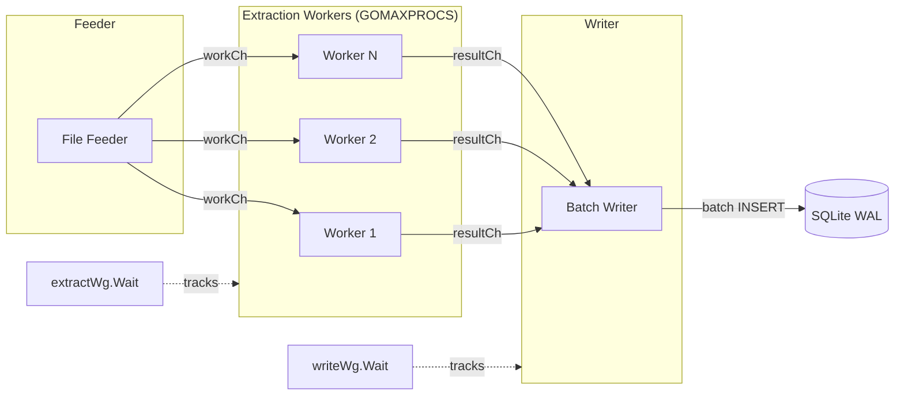
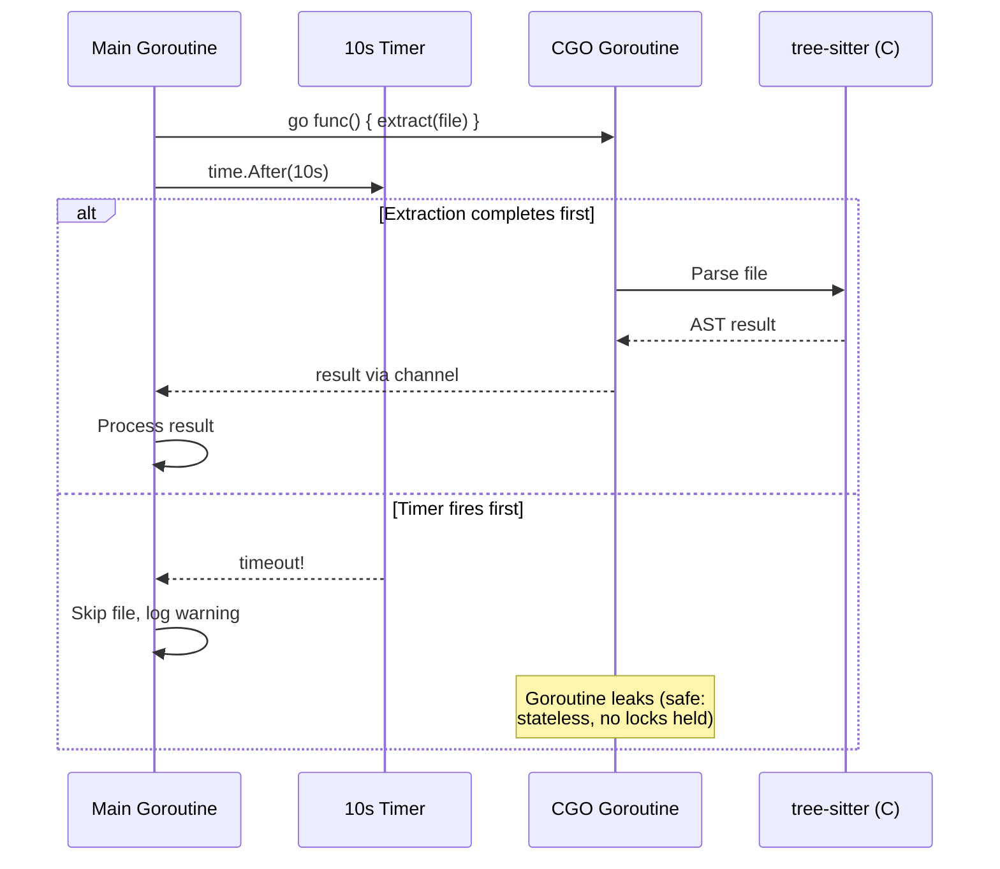
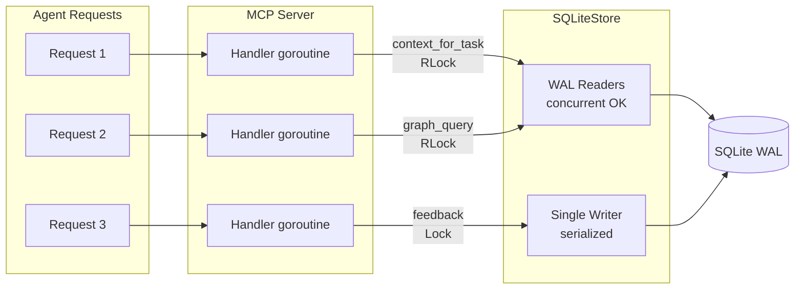
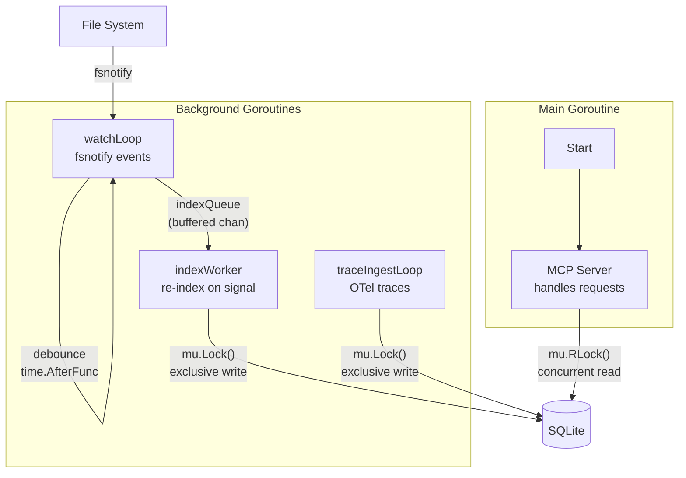

# Concurrency Primer

This guide explains where knowing uses Go's concurrency primitives and, more importantly, where it does not. Most of the codebase is sequential. Concurrency exists in six subsystems, each for a specific reason. If you are adding code to knowing, read this before reaching for `go`.

## Overview

knowing uses goroutines, channels, `sync.WaitGroup`, `sync.Mutex`, `sync.RWMutex`, `sync/atomic`, and semaphore-patterned buffered channels. The indexer pipeline and the enrichment system are the two largest concurrent subsystems. The retrieval path (RWR, HITS, ranking, packing) is entirely sequential but uses a precomputed adjacency cache to eliminate per-node database queries during the walk. The MCP server handles concurrent requests but delegates all coordination to SQLite's WAL mode.

The guiding principle: add concurrency only where a measurable bottleneck exists. Extraction is CPU-bound (tree-sitter parsing). SQLite writes are IO-bound. Separating them into a pipeline doubles throughput. LSP enrichment is IO-bound (network round-trips to language servers). Parallelizing LSP calls with serialized DB writes gives near-linear speedup. Retrieval already completes in under 100ms, so parallelizing it would add complexity for no user benefit.

## The Indexer Pipeline

The indexer (`internal/indexer/indexer.go`) uses a producer-consumer pipeline to overlap CPU-bound extraction with IO-bound storage.

**Pipeline architecture:**



**Architecture:**

```
[workCh] --> N extraction workers --> [resultCh] --> 1 storage writer --> SQLite
```

- **N extraction workers** (defaults to `runtime.GOMAXPROCS(0)`) read file indices from `workCh` and produce `fileResult` values into `resultCh`.
- **1 writer goroutine** (the main goroutine of `IndexRepo`) reads from `resultCh` and batches results into SQLite.
- **`extractWg`** tracks when all workers have finished, so the feeder goroutine knows when to close `resultCh`.
- **Channel backpressure:** `resultCh` is buffered at `numWorkers*2`. If the writer falls behind, workers block on the send rather than accumulating unbounded results in memory.

```go
resultCh := make(chan fileResult, numWorkers*2)
```

**Why this design:** extraction is CPU-bound (tree-sitter parsing takes 1-10ms per file). SQLite writes are IO-bound (batch INSERT across a transaction). Running them in the same goroutine means the CPU sits idle during writes and the disk sits idle during parsing. The pipeline keeps both saturated.

### Error Propagation Across Goroutine Boundaries

Extraction workers send errors through `resultCh` as part of the `fileResult` struct. There is no separate error channel. The writer goroutine (main goroutine) checks each result:

```go
for fr := range resultCh {
    if fr.err != nil {
        storeErr = fmt.Errorf("extract file %s: %w", fr.relPath, fr.err)
        break
    }
    // ... batch and store ...
}
```

When an error occurs, the writer breaks out of the loop. This means:

1. Remaining results still buffered in `resultCh` are abandoned (never read).
2. Workers that try to send after the writer stops will block until the process exits.
3. The function returns `storeErr` to its caller.
4. Partial data already flushed to SQLite in previous batches remains (knowing's content-addressed design makes this safe; the next index run will re-extract the failed file).

**Why not use a separate error channel?** A single struct keeps the code simpler. The pipeline stops on first error rather than accumulating partial results because a half-indexed file would leave the graph inconsistent. The next run picks up where this one failed.

### Batch Flush Timing

The writer goroutine accumulates results and flushes them to SQLite under two conditions:

```go
const batchSize = 500

if len(batchFiles) >= batchSize || completed == totalFiles {
    // Flush batch to DB...
}
```

1. **Every 500 files:** once the batch accumulates 500 file results, flush immediately. This bounds memory usage (at most 500 files' worth of nodes/edges in memory) and gives SQLite data within seconds of starting.
2. **When the channel drains (final batch):** when `completed == totalFiles`, flush whatever remains, even if it is less than 500 files. This handles the tail end of processing.

**Why 500?** Empirically, 500 files produce roughly 2000-5000 nodes and a similar number of edges. Each multi-row INSERT stays well under SQLite's 999-variable limit. Larger batches reduce transaction overhead; smaller batches reduce memory. 500 is the sweet spot tested on repos from 1K to 200K files.

**Kill safety:** because batches flush incrementally, killing the process at any time leaves a partial but valid graph in SQLite. The next run detects which files were not indexed (via content-hash comparison) and picks them up.

### What Happens if the Writer Goroutine Panics

The writer goroutine is the main goroutine of `IndexRepo` (the `for fr := range resultCh` loop). If it panics:

1. The panic propagates up the call stack and crashes the process (or is caught by a higher-level `recover` if one exists).
2. Extraction workers continue running until they try to send on `resultCh`. Since nobody is reading, buffered slots fill up and workers block permanently.
3. The feeder goroutine (which closes `resultCh` after `extractWg.Wait()`) also blocks because workers never finish.
4. Go's runtime detects the main goroutine panic and tears down all goroutines.

**In practice this is not a concern** because the writer loop's operations (append to slice, call `BatchPutNodes`) do not panic under normal conditions. SQLite errors are returned, not panicked. The only realistic panic source would be a nil pointer dereference on a malformed `fileResult`, which would indicate a bug in an extractor.

## The CGO Watchdog Pattern

**Problem:** tree-sitter is a C library called via CGO. Go's `context.WithTimeout` cancels goroutines by closing a channel, but CGO calls cannot be interrupted by Go. A file with pathological nesting (e.g., deeply nested JSON) can block a tree-sitter parse for minutes.

**Solution:** fire-and-forget goroutine with a timer select.

**Watchdog timeout flow:**



```go
done := make(chan extractResult, 1)
go func() {
    r, f, err := idx.extractFile(ctx, opts)
    done <- extractResult{result: r, file: f, err: err}
}()

timer := time.NewTimer(10 * time.Second)
select {
case er := <-done:
    timer.Stop()
    resultCh <- fileResult{...}
case <-timer.C:
    // Extraction stuck in CGO. Skip this file.
    resultCh <- fileResult{result: &types.ExtractResult{}, ...}
}
```

If the timer fires first, the file is skipped. The background goroutine eventually completes and its result is discarded (nobody reads from `done`). The goroutine "leaks" in the sense that it continues running, but Go's runtime cleans it up on process exit.

**Why this is safe:** extraction is stateless per-file. A leaked goroutine holds no locks, writes nothing to the database, and mutates no shared state. The only cost is memory for the parse tree until the CGO call returns.

**Why not `context.WithTimeout`?** Go contexts cancel by closing a channel. For pure-Go code, goroutines check `ctx.Done()` between operations and exit early. But CGO calls are opaque to the Go runtime: the C code never checks channel state, so context cancellation has no effect on a running tree-sitter parse. The watchdog pattern is the only reliable way to bound CGO execution time.

## The Git Blame Worker Pool

After extraction completes, the indexer runs git blame on each changed file to extract authorship edges (`authored_by`). This is expensive (one subprocess per file) and parallelized with a dedicated worker pool.

**Architecture:**

```go
blameResults := make([]blameResult, len(allFiles))  // pre-allocated, indexed by file
var blameWg sync.WaitGroup
blameCh := make(chan int, len(allFiles))

for w := 0; w < blameWorkers; w++ {
    blameWg.Add(1)
    go func() {
        defer blameWg.Done()
        for i := range blameCh {
            // Run git blame, store result at blameResults[i]
            blameResults[i] = blameResult{nodes: an, edges: ae}
        }
    }()
}
```

**Key pattern: pre-allocated results slice.** Each worker writes to `blameResults[i]` where `i` is the file index it received from the channel. Because each index is unique (the channel sends each `i` exactly once), workers never write to the same slot. This eliminates the need for a mutex on the results collection.

**Why this is safe without synchronization:**
- Each `i` is sent exactly once on `blameCh`, so only one worker ever writes to `blameResults[i]`.
- `blameWg.Wait()` provides the happens-before guarantee: all writes complete before the main goroutine reads the results.
- Workers read `allFiles[i]` (shared immutable slice, set before workers start) and call `idx.store.NodesByFilePath` (thread-safe read, WAL mode).

**Error handling:** errors from individual `git blame` invocations are silently skipped (`continue`). This is intentional: authorship is best-effort metadata. A file that fails blame (binary file, detached HEAD, shallow clone) should not block the index run.

## The Enrichment System

The enricher (`internal/enrichment/enricher.go`) upgrades `ast_inferred` edges to `lsp_resolved` by querying language servers (gopls, typescript-language-server, pyright, etc.). It introduces several concurrency patterns distinct from the indexer because the bottleneck is LSP round-trip latency rather than CPU.

### Producer-Consumer for Edge Upgrades

`upgradeCallEdges` uses the same producer-consumer pattern as the indexer but inverted: workers are IO-bound (waiting for LSP responses) rather than CPU-bound.

**Architecture:**

```
[workItems] --> N LSP workers (semaphore-bounded) --> [results channel] --> 1 DB writer
```

- **N LSP workers** (bounded by `e.concurrency`, default 8) resolve edges via `GetDefinition`. Each worker acquires a slot from a buffered-channel semaphore before issuing the LSP call.
- **1 writer goroutine** reads from `results` and serializes all `DeleteEdge`/`PutEdge` mutations against SQLite.
- **`writerWg`** ensures the writer finishes before `upgradeCallEdges` returns.

```go
// Semaphore: buffered channel limits concurrent LSP calls.
sem := make(chan struct{}, e.concurrency)

// Results channel: parallel workers -> serial writer.
results := make(chan edgeResolveResult, e.concurrency*2)
```

**Why this design:** LSP calls take 5-50ms each. With 8 concurrent workers, 2000 edges resolve in ~15 seconds instead of ~100 seconds sequentially. The single writer avoids SQLite `SQLITE_BUSY` contention entirely.

### Semaphore Pattern (Buffered Channel as Concurrency Limiter)

Both `upgradeCallEdges` and `discoverNewEdgesBatched` use the same semaphore pattern:

```go
sem := make(chan struct{}, e.concurrency)

for i := range workItems {
    wg.Add(1)
    sem <- struct{}{}  // blocks when concurrency slots are full

    go func(item WorkItem) {
        defer wg.Done()
        defer func() { <-sem }()  // release slot

        // ... do work ...
    }(workItems[i])
}

wg.Wait()
```

The pattern is a bounded fan-out: the main goroutine spawns workers but blocks on the semaphore send when all slots are occupied. Each worker releases its slot on completion. Unlike a fixed pool of long-lived workers, this pattern spawns one goroutine per work item but never exceeds `e.concurrency` active goroutines at once.

### File-Level Parallelism in Discovery

`discoverNewEdgesBatched` (`internal/enrichment/enricher.go`) processes files in batches of 50. Within each batch, individual files are queried concurrently (bounded by the semaphore). Between batches, files are closed to release LSP server memory (gopls on Kubernetes with 3K open files consumes 900MB+).

```
Batch 1: open 50 files -> concurrent symbol queries -> close 50 files
Batch 2: open 50 files -> concurrent symbol queries -> close 50 files
...
```

**DB writes from concurrent workers** are serialized by `e.writeMu`:

```go
type Enricher struct {
    // ...
    writeMu sync.Mutex  // serializes DB writes from concurrent discover workers
}

func (e *Enricher) insertEdgesFromLocations(...) {
    for _, loc := range locations {
        e.writeMu.Lock()
        existing, err := e.store.GetEdge(ctx, edgeHash)
        if err != nil || existing != nil {
            e.writeMu.Unlock()
            continue
        }
        _ = e.store.PutEdge(ctx, edge)
        e.writeMu.Unlock()
    }
}
```

The `writeMu` ensures that the check-then-insert for each edge is atomic. Without it, two workers discovering the same edge could both pass the existence check and attempt duplicate inserts (causing SQLite UNIQUE constraint violations or SQLITE_BUSY).

### Multi-Module Orchestration

`runMultiModule` (`internal/enrichment/enricher.go`) handles Go workspaces with multiple `go.mod` files. Each module needs its own gopls instance because gopls operates per-module.

**Strategy:**

1. **Root module (sequential):** processed first, solo, because it is typically large (1000+ files, 1.2GB gopls memory).
2. **Sub-modules (4 parallel):** processed concurrently after the root completes. Sub-modules are small (200-500 files each), so 4 simultaneous gopls instances use ~800MB total.

```go
const moduleParallelism = 4

modSem := make(chan struct{}, moduleParallelism)
var modWg sync.WaitGroup

for i := range subModules {
    modWg.Add(1)
    modSem <- struct{}{}

    go func(mod ModuleInfo, idx int) {
        defer modWg.Done()
        defer func() { <-modSem }()
        e.enrichModule(ctx, serverCfg, ..., mod, ...)
    }(subModules[i], i)
}

modWg.Wait()
```

Each `enrichModule` call starts its own gopls instance, runs the full enrichment pipeline (upgrade + discover), and shuts down the server. Progress is tracked so interrupted runs resume without re-processing completed modules.

### Per-Symbol Timeout with Child Context

`WithSymbolTimeout` (`internal/enrichment/timeout.go`) wraps each LSP call in a timeout without cancelling the parent context:

```go
func WithSymbolTimeout(ctx context.Context, timeout time.Duration, fn func(ctx context.Context) error) error {
    childCtx, cancel := context.WithTimeout(ctx, timeout)
    defer cancel()

    done := make(chan error, 1)
    go func() {
        done <- fn(childCtx)
    }()

    select {
    case err := <-done:
        return err
    case <-childCtx.Done():
        if ctx.Err() != nil {
            return ctx.Err()  // parent cancelled
        }
        return ErrSymbolTimeout  // only this symbol timed out
    }
}
```

**Key property:** cancelling the child context does NOT cancel the parent. If one symbol's `GetReferences` call hangs (e.g., gopls analyzing a massive package), only that symbol is skipped. The remaining symbols in the file continue processing normally. The default timeout is 10 seconds per symbol.

### Atomic Counters for Statistics

`enrichStats` uses `sync/atomic.Int64` fields for lock-free concurrent updates:

```go
type enrichStats struct {
    edgesProcessed atomic.Int64
    edgesUpgraded  atomic.Int64
    edgesSkipped   atomic.Int64
    edgeErrors     atomic.Int64
    newEdges       atomic.Int64
    filesProcessed atomic.Int64
    fileErrors     atomic.Int64
}
```

Multiple LSP workers call `stats.edgesProcessed.Add(1)` concurrently without coordination. The final log summary reads all counters after `wg.Wait()` ensures all workers have completed (happens-before).

### Progress Persistence with Atomic File Writes

`EnrichProgress` (`internal/enrichment/progress.go`) tracks per-module completion for crash recovery:

- **Thread safety:** `sync.Mutex` protects the `Modules` map. `MarkModule` and `IsComplete` both acquire the lock.
- **Crash safety:** `SaveProgress` writes to a `.tmp` file first, then atomically renames it over the target. If the process crashes during the write, the previous progress file remains intact.
- **Resume semantics:** on startup, `LoadProgress` reads the file. Modules with `Completed: true` are skipped. This prevents re-enriching modules that finished in a previous (interrupted) run.

```go
func SaveProgress(workspaceRoot string, p *EnrichProgress) error {
    tmp := target + ".tmp"
    os.WriteFile(tmp, data, 0644)
    return os.Rename(tmp, target)  // atomic on POSIX
}
```

## SQLite Single-Writer

SQLite in WAL (Write-Ahead Logging) mode allows any number of concurrent readers but exactly one writer at a time. knowing's architecture respects this constraint at every level.

**Pragmas** (set in `internal/store/sqlite.go`):

| Pragma | Value | Why |
|--------|-------|-----|
| `journal_mode` | WAL | Concurrent readers during writes |
| `synchronous` | NORMAL | fsync on checkpoint only, not every commit |
| `busy_timeout` | 5000 | Retry for 5s on lock contention instead of immediate SQLITE_BUSY |
| `mmap_size` | 268435456 | 256MB memory-mapped IO for read-heavy workloads |
| `cache_size` | -64000 | 64MB page cache |

**Batch INSERT strategy:** multi-row INSERT statements pack multiple rows per SQL statement to reduce transaction overhead. The chunk sizes are chosen to stay under SQLite's 999-variable limit:

- Edges: 100 per statement (9 params each = 900)
- Nodes: 99 per statement (10 params each = 990)
- Files: 249 per statement (4 params each = 996)

**Design rule:** all writes flow through the single writer goroutine in the indexer pipeline. Extraction workers never touch the database directly. They produce results into `resultCh`, and the writer goroutine consumes them.

## In-Memory Node/Edge Cache (sync.Map + Atomic)

The `SQLiteStore` (`internal/store/sqlite.go`) layers an in-process cache on top of SQLite to eliminate redundant SQL round-trips on hot-path traversals (blast_radius walks hundreds of edges, each requiring a node lookup).

**Implementation:**

```go
type SQLiteStore struct {
    db *sql.DB

    nodeCache      sync.Map       // types.Hash -> *types.Node
    nodeCacheCount atomic.Int64

    edgeCache      sync.Map       // types.Hash -> *types.Edge
    edgeCacheCount atomic.Int64
}
```

**Why `sync.Map` instead of `map` + `RWMutex`?** The access pattern is heavily read-biased: many concurrent MCP handlers read cached nodes, while writes happen rarely (only on cache miss). `sync.Map` is optimized for this pattern. It uses internal atomics and copy-on-write techniques that avoid lock contention for reads, whereas `RWMutex` still contends on the read counter.

**Eviction strategy (full clear at capacity):**

```go
const nodeCacheMaxEntries = 50_000

func (s *SQLiteStore) GetNode(ctx context.Context, hash types.Hash) (*types.Node, error) {
    if v, ok := s.nodeCache.Load(hash); ok {
        return v.(*types.Node), nil
    }
    // ... query DB ...
    if s.nodeCacheCount.Load() >= nodeCacheMaxEntries {
        s.nodeCache.Range(func(k, _ any) bool {
            s.nodeCache.Delete(k)
            return true
        })
        s.nodeCacheCount.Store(0)
    }
    s.nodeCache.Store(hash, n)
    s.nodeCacheCount.Add(1)
    return n, nil
}
```

When the cache exceeds 50,000 entries, it is cleared entirely. This is the simplest possible eviction: no LRU tracking, no sharding, no partial eviction. It works because:

1. The cache refills quickly (blast_radius traversals re-populate hundreds of entries per call).
2. 50K entries is bounded memory (roughly 50K * 200 bytes = 10MB).
3. Full cache clear happens rarely in practice (only during very large traversals or after indexing many repos).

**Invalidation:** `InvalidateCache()` clears both caches completely. It is called at the start of each index run so freshly written rows are not shadowed by stale cached values.

**Thread safety of eviction:** the `Range` + `Delete` pattern is safe with `sync.Map` (it tolerates concurrent loads during deletion). The atomic counter might briefly go negative if multiple goroutines evict simultaneously, but `Store(0)` resets it. In practice, GetNode is only called from MCP handlers (read path) and eviction is extremely rare.

## SubgraphCache and Merkle-Keyed Invalidation

The `SubgraphCache` (`internal/cache/subgraph.go`) caches serialized query results (blast_radius, test_scope) keyed by the Merkle root hash of the queried subgraph.

**Thread safety:** `sync.RWMutex` protects the entries map:
- `Get`: acquires read lock to check the map, then acquires write lock to update hit/miss counters.
- `Put`: acquires exclusive write lock.
- `InvalidatePackages`: acquires exclusive write lock.

**Merkle-keyed invalidation:**

The hierarchical Merkle tree assigns each package a root hash derived from all its edges. When a file changes, only its package's root hash changes. Cache entries are keyed by this package root hash, so:

1. After each index run, the daemon computes `DiffHierarchicalTrees(prevTree, newTree)`.
2. The diff produces `ChangedPackages`, `AddedPackages`, `RemovedPackages`.
3. For each changed package, the daemon calls `cache.InvalidatePackages(changedPkgs, newTree)`.
4. `InvalidatePackages` looks up each package's new root hash in the tree and deletes the entry.

```go
func (c *SubgraphCache) InvalidatePackages(packages []string, tree *snapshot.HierarchicalTree) {
    c.mu.Lock()
    defer c.mu.Unlock()
    for _, pkg := range packages {
        root, ok := tree.PackageRoots[pkg]
        if !ok {
            continue
        }
        delete(c.entries, root)
    }
}
```

**Why this works:** if a package has NOT changed, its Merkle root is the same, so any cached result for that root is still valid. Only changed packages get evicted. On a 200K-edge graph where a single file changes, this evicts one or two cache entries instead of the entire cache.

**Eviction at capacity:** when the cache is full and a new key is being inserted, one random entry is removed (Go map iteration order is random). This is O(1) and avoids the complexity of LRU tracking. For knowing's use case (bounded query diversity, most queries repeat), random eviction performs well.

## Thread-Safe Extractors

Each `Extract()` call creates its own tree-sitter parser instance. Parsers are cheap to create (approximately 1 microsecond) but are NOT goroutine-safe. The tree-sitter C library uses internal state that is mutated during parsing.

The extractor struct itself (e.g., `GoExtractor`, `PythonExtractor`) is stateless: it has no mutable fields. This means many goroutines can call `Extract()` on the same extractor instance concurrently, because each call allocates its own parser on the stack.

**Rules:**
- Never share a `*sitter.Parser` between goroutines.
- Never store a parser as a field on an extractor struct.
- Creating a parser per-call is intentional, not wasteful.

When multiple extractors handle the same file (e.g., Go extractor + proto extractor), the first one that parses sets `opts.ParsedTree`; subsequent extractors reuse the same parsed tree. This reuse happens within a single goroutine (the extraction loop for one file), so there is no concurrency concern.

## No Concurrency in Retrieval (But Two Key Precomputation Patterns)

The context engine (`internal/context/walk.go`) and all retrieval paths (`ForTask`, `ForFiles`, `ForPR`) are fully sequential. No goroutines run during the walk. However, two patterns eliminate the performance bottlenecks that would otherwise tempt parallelization:

### Adjacency Cache (Precomputed Binary Blob)

`BuildAdjacencyCache` (`internal/context/walk.go`) serializes the entire edge set into a compact binary format and stores it in the `notes` table. During RWR, `buildFromCache` deserializes and runs BFS entirely in memory (zero DB queries during the walk itself).

**Binary format:** `[num_edges: 4 bytes LE]` followed by `num_edges` records of `[source: 32 bytes][target: 32 bytes][type_id: 1 byte]` = 65 bytes per edge.

```go
func BuildAdjacencyCache(ctx context.Context, store types.GraphStore) error {
    allEdges, _ := bulk.AllEdges(ctx)
    buf := bytes.NewBuffer(make([]byte, 0, 4+len(allEdges)*65))
    binary.LittleEndian.PutUint32(header, uint32(len(allEdges)))
    buf.Write(header)
    for _, e := range allEdges {
        buf.Write(e.SourceHash[:])
        buf.Write(e.TargetHash[:])
        buf.WriteByte(adjEdgeTypeToID[e.EdgeType])
    }
    // Store base64-encoded in notes table.
}
```

**Performance impact:** on a 200K-edge graph, the fallback path (per-node `EdgesFrom`/`EdgesTo` queries during BFS) takes ~80ms. With the adjacency cache, the same walk completes in ~2ms (4717x improvement measured in benchmarks). The cache is rebuilt after each index run while the daemon's write lock is held.

**Why not just keep edges in memory?** The MCP server is a long-running daemon, but `knowing index` (CLI mode) starts fresh each time. The binary cache persists across process restarts without loading all edges on startup. It also avoids the memory cost of holding all edges in Go heap structures (the base64 blob is stored in SQLite and decoded on demand).

### Double-Buffer Map Pattern (Zero-Allocation Iteration)

`rwrIterate` (`internal/context/walk.go`) uses two pre-allocated maps that swap roles each iteration:

```go
mapA := make(map[types.Hash]float64, len(seedVec)*4)
mapB := make(map[types.Hash]float64, len(seedVec)*4)

prob := mapA
for iter := 0; iter < maxIter; iter++ {
    next := mapB
    for k := range next {
        delete(next, k)  // clear without reallocating
    }
    // ... compute next distribution into `next` ...
    prob, next = next, prob
    mapA, mapB = mapB, mapA
}
```

**Why this matters:** Go's garbage collector tracks map allocations. Creating a new map each iteration (20 iterations on a 5000-entry map) generates 20 allocations of ~40KB each, all becoming garbage simultaneously. The double-buffer pattern reuses two maps across all iterations: `mapB` is cleared (keys deleted, backing storage retained) and refilled. GC pressure drops to zero for the iteration loop.

### Early Termination (Top-K Stability)

RWR terminates early when the top-10 ranked nodes are stable for 2 consecutive iterations, even if low-ranked nodes are still shifting. `topKFromProb` extracts the top-10 hashes into a fixed `[10]types.Hash` array that is compared by value between iterations. This typically saves 5-8 iterations on large graphs where the tail never fully converges.

### Summary: Why No Goroutines

- **RWR:** pre-loads the adjacency map via the binary cache (one read, then in-memory BFS), then iterates over the map with double-buffered power iteration. No goroutines.
- **HITS:** runs on a pre-selected subset of nodes. Pure linear algebra on slices.
- **Ranking and packing:** sorting and knapsack on scored nodes. Pure computation.

**Why not parallelize?** Retrieval completes in under 100ms for typical queries (tested on graphs with 200K+ edges). The adjacency cache eliminates the DB-query bottleneck. The iteration loop is pure computation on in-memory maps, which parallelizes poorly (each iteration depends on the previous). Adding goroutines would introduce synchronization overhead for no measurable benefit.

## MCP Server Request Handling

The MCP server (`internal/mcp/server.go`) handles multiple client requests concurrently:

**Concurrent readers with serialized writes:**



- **Stdio mode:** the mcp-go library multiplexes JSON-RPC requests over stdin/stdout, dispatching each to its own goroutine.
- **HTTP mode:** standard `net/http` server spawns a goroutine per connection.

All request handlers share a single `SQLiteStore` instance. This is safe because:

1. WAL mode allows unlimited concurrent readers.
2. Read-only handlers (blast_radius, context_for_task, etc.) only call SELECT queries.
3. Write handlers (index_repo, feedback) go through SQLite's internal serialization. If two writes overlap, `busy_timeout=5000` causes the second to retry for up to 5 seconds.

**Shared state between handlers:**

| State | Protection | Why |
|-------|-----------|-----|
| `SQLiteStore` | WAL + busy_timeout | Read concurrency is native to SQLite |
| `nodeCache` / `edgeCache` | sync.Map + atomic | Lock-free reads, bounded by count |
| `SubgraphCache` | sync.RWMutex | Multiple readers, exclusive writes |
| `contextCalls` / `symbolsServed` | atomic.Int64 | Lock-free counter increments |
| `wire.Session` | Internal to package | Deduplication state for GCF format |
| `vecSearch` (embedding index) | Built once at startup | Read-only after background build |

**Atomic counters:** session-level metrics (`contextCalls`, `symbolsServed`) use `atomic.Int64` for lock-free concurrent increments. These are used for the `knowing://session` resource that reports usage stats.

**Background vector index build:** at server startup, if KNOWING_EMBEDDINGS=1 is set, a goroutine builds the HNSW vector index by embedding all nodes. This goroutine accesses the store (read-only, safe via WAL) and writes to the searcher's internal index. The searcher is not used until the build completes (handlers check `vecSearch != nil` and the searcher internally handles partial state).

## Daemon File Watcher

The daemon (`internal/daemon/daemon.go`) runs four concurrent goroutines coordinated by a `sync.RWMutex`:

**Daemon goroutine architecture:**



1. **watchLoop:** reads `CommitEvent` values from `GitWatcher` and enqueues index requests into a buffered channel.
2. **indexWorker:** drains the index queue sequentially, holding the daemon's write lock during each index run.
3. **MCP server:** serves queries, acquiring a read lock for each request.
4. **traceIngestLoop** (optional): runs OTLP trace ingestion with its own dedicated DB connection.

**Debounce pattern:** the `GitWatcher` monitors `.git/HEAD` and ref files via fsnotify. A single git operation (commit, rebase, merge) can trigger multiple file writes in rapid succession. Each write resets a per-repo `time.AfterFunc` timer (default 500ms). Only when the timer fires (no writes for 500ms) does the watcher emit a `CommitEvent`. This coalesces rapid changes into a single re-index.

```go
p.timer = time.AfterFunc(gw.debounce, func() {
    gw.handleCommitChange(repoPath)
})
```

**Lock protocol:**
- `indexWorker` acquires `d.mu.Lock()` (exclusive) during indexing. MCP queries block until indexing completes.
- MCP handlers acquire `d.mu.RLock()` (shared). Multiple queries run concurrently.
- After indexing completes, a background goroutine spawns for LSP enrichment. This goroutine does NOT hold the write lock, so queries resume immediately.

**Why exclusive lock during indexing?** Without it, a query could read a half-written graph (some files indexed, others not). The lock ensures readers always see a complete, consistent snapshot.

**Index queue overflow:** the `indexQueue` channel is buffered at 128. If the queue is full when a new commit event arrives, the event is dropped (`select { case d.indexQueue <- req: default: }`). This prevents unbounded memory growth if indexing falls behind rapid commits. The next commit event will trigger a fresh re-index that picks up all accumulated changes.

### Community Detection Inside the Write Lock

After a successful index run, the daemon runs incremental community detection while still holding the write lock:

```go
d.mu.Lock()
indexErr := d.cfg.IndexFunc(ctx, ...)

// Still under write lock:
if indexErr == nil && d.cfg.Store != nil {
    d.runIncrementalCommunities(ctx, req.repoURL, changedPkgs)
}

d.mu.Unlock()
```

**Why inside the lock?** Community detection writes to `graph_notes` (via `SaveAssignments`). If it ran outside the lock, a concurrent MCP query reading community assignments could see partially-written state (some nodes assigned, others still with stale assignments). Running inside the lock guarantees atomicity from the readers' perspective.

**Performance impact:** incremental community detection (`DetectIncremental`) only recomputes assignments for nodes in changed packages. Unchanged nodes keep their previous assignment (frozen). For a typical edit affecting one package, this completes in under 100ms even on a 5000-node graph. The full Louvain algorithm only runs on the first index (no previous assignments exist).

**Also inside the lock:** Merkle diff computation, cache invalidation, and scoped FTS rebuild. These are all fast operations (map lookups and bounded writes) that must be atomic with the index to prevent readers from seeing intermediate state.

## FTS Rebuild: Parallel Computation, Sequential Writes

The `RebuildFTS` method in `SQLiteStore` splits work into three phases:

```go
// Phase 1: Read all nodes into memory (sequential, DB query).
var allRows []ftsRow
// ... scan rows ...

// Phase 2: Parallel splitForFTS computation (CPU-bound, 8 workers).
var wg sync.WaitGroup
workers := 8
chunkSize := (len(allRows) + workers - 1) / workers
for w := 0; w < workers; w++ {
    wg.Add(1)
    go func(s, e int) {
        defer wg.Done()
        for i := s; i < e; i++ {
            prepped[i] = ftsPrepped{...splitForFTS(...)...}
        }
    }(start, end)
}
wg.Wait()

// Phase 3: Batch INSERT into SQLite (sequential, single writer).
tx, _ := s.db.BeginTx(ctx, nil)
for _, p := range prepped {
    stmt.ExecContext(ctx, ...)
}
tx.Commit()
```

**Why parallelize only Phase 2?** `splitForFTS` splits CamelCase and snake_case identifiers into tokens. On 100K+ nodes, this string manipulation is the bottleneck (not the DB writes). Phase 1 and 3 are I/O-bound (SQLite queries and inserts) and cannot be parallelized due to single-writer constraint.

**Same pre-allocated slice pattern as git blame:** each worker writes to `prepped[i]` for indices in its assigned range. No synchronization needed because ranges do not overlap.

## Common Pitfalls for Contributors

### Real Bugs That Happened

These are not hypothetical warnings. Each was a bug that shipped, was discovered in production or benchmarks, and was fixed. Learn from them.

**1. The FTS Background Goroutine Bug** (fixed in `cab5f79`)

The original code ran FTS rebuild in a fire-and-forget goroutine:

```go
// BROKEN: FTS never completes in CLI mode.
go func() {
    _ = fr.RebuildFTS(context.Background())
}()
return snap, nil  // process exits here, killing the goroutine
```

In daemon mode this worked fine (process stays alive). In CLI mode (`knowing index`), the process exits immediately after `IndexRepo` returns, killing the goroutine before FTS writes complete. Result: `nodes_fts_content` was always empty for CLI-indexed repos. BM25 search returned zero results.

**Fix:** run FTS synchronously after snapshot computation. The 200-300ms cost is acceptable because CLI mode is not latency-sensitive.

**Lesson:** never use fire-and-forget goroutines for work that MUST complete. If the caller can exit before the goroutine finishes, the work will be lost. Use `sync.WaitGroup` or run synchronously.

**2. The SQLite WAL Contention Bug** (fixed in `950b91b`)

An earlier optimization ran FTS rebuild and snapshot computation concurrently:

```go
// BROKEN: both compete for SQLite WAL locks.
var wg sync.WaitGroup
wg.Add(2)
go func() { defer wg.Done(); computeSnapshot() }()
go func() { defer wg.Done(); rebuildFTS() }()
wg.Wait()
```

Both operations are write-heavy (snapshot writes a row, FTS does thousands of INSERTs). With SQLite's single-writer constraint, they serialize anyway via `busy_timeout`. Worse, the contention causes both to be slower than running sequentially (retry overhead). Snapshot computation went from 50ms to 800ms.

**Fix:** run snapshot first (fast, small write), then FTS (slow, heavy writes). Sequential execution is faster than contention.

**Lesson:** parallelizing two write-heavy SQLite operations gives you the worst of both worlds: contention overhead plus no actual concurrency. Only parallelize reads (concurrent via WAL) or CPU work (no DB access).

**3. The CGO Timeout Stall** (watchdog pattern prevents this)

Before the watchdog pattern existed, a single pathological file (deeply nested JSON with 1000+ levels) could stall the entire pipeline for 3+ minutes. All workers were blocked waiting for `resultCh` to drain (the writer was waiting for this worker), and the writer was waiting for this result. The pipeline deadlocked in slow motion.

The watchdog pattern (fire-and-forget + timer) ensures no single file blocks the pipeline for more than 10 seconds.

### Rules for New Code

4. **Don't add goroutines to the retrieval path.** It is fast enough (<100ms). Goroutines add complexity, make debugging harder, and provide no measurable speedup for in-memory computation.

5. **Don't share tree-sitter parsers between goroutines.** The C library uses internal mutable state. Create a new parser per `Extract()` call.

6. **Don't write to SQLite from extraction workers.** Use the `resultCh` channel. The single-writer goroutine owns all database mutations during indexing. Writing from workers causes SQLITE_BUSY errors and data races.

7. **Don't use `context.WithTimeout` to cancel CGO calls.** It does not work. Go contexts cancel by closing a channel; CGO calls cannot observe channel state. Use the watchdog pattern (fire-and-forget goroutine + timer select) instead.

8. **Don't hold locks across channel sends.** If the channel is full (backpressure), the send blocks. If you are holding a mutex, other goroutines waiting for that mutex also block. This creates a deadlock where the channel consumer needs the lock to make progress but cannot acquire it.

9. **Don't bypass the daemon's `sync.RWMutex`.** If you are adding a new background task that modifies the graph, it must acquire the write lock. If it only reads, it must acquire the read lock. Forgetting this causes readers to see inconsistent state.

10. **Don't run expensive computation inside a lock.** The daemon's write lock blocks all MCP queries. Keep the critical section as short as possible: do expensive work (tree-sitter parsing, git blame) outside the lock, then acquire the lock only for the final database writes and fast post-processing (community detection, cache invalidation).

11. **Don't use fire-and-forget goroutines for work that must complete.** If the process might exit before the goroutine finishes, the work is silently lost. Either run synchronously, track with a `WaitGroup` on the daemon's `wg`, or use a buffered channel that is drained on shutdown.

12. **Don't parallelize multiple SQLite write operations.** WAL mode only helps readers. Writers still serialize. Running two write-heavy operations concurrently causes `busy_timeout` retry overhead that makes both slower than sequential execution.

13. **Don't write to SQLite from enrichment LSP workers directly.** Use the `results` channel (for edge upgrades) or acquire `e.writeMu` (for discovery). The enrichment system uses the same "parallel work, serial persistence" principle as the indexer but with different mechanisms depending on the phase.

14. **Don't cancel the parent context when an LSP call times out.** Use `WithSymbolTimeout` which creates a child context. Cancelling the parent would abort all remaining work for the file or batch. Only the individual symbol that timed out should be skipped.

15. **Don't open all files at once in the enrichment system.** gopls consumes 300-900MB+ when thousands of files are open simultaneously. Use `discoverNewEdgesBatched`'s pattern: open a batch, query symbols, close the batch before opening the next. Memory stays bounded at ~50 files' worth of LSP server state.

16. **Don't skip the writeMu in `insertEdgesFromLocations`.** The check-then-insert for each edge must be atomic. Without the mutex, two concurrent discover workers that find the same edge would both pass the existence check and attempt duplicate writes.

## Quick Reference Table

| Subsystem | Primitives Used | Concurrency Level |
|-----------|----------------|-------------------|
| Indexer extraction | goroutines, channels, WaitGroup | N workers (GOMAXPROCS) |
| Indexer storage | single goroutine reading from channel | 1 writer |
| CGO watchdog | goroutine, select, Timer | 1 per file (fire-and-forget) |
| Enrichment edge upgrade | semaphore (buffered chan), WaitGroup, results channel | 8 LSP workers, 1 DB writer |
| Enrichment discovery | semaphore (buffered chan), WaitGroup, Mutex (writeMu) | 8 concurrent per batch |
| Enrichment multi-module | semaphore (buffered chan), WaitGroup, atomic.Int64 | 1 root sequential, 4 sub-modules parallel |
| Enrichment per-symbol timeout | context.WithTimeout, goroutine, select | child context per LSP call |
| Enrichment progress | sync.Mutex, atomic file write (rename) | mutex-protected map, crash-safe persistence |
| Enrichment stats | sync/atomic.Int64 | lock-free increments from all workers |
| SQLite store | WAL mode, busy_timeout pragma | N readers, 1 writer |
| Node/edge cache | sync.Map, atomic.Int64 | lock-free reads |
| SubgraphCache | sync.RWMutex | N readers, exclusive writes |
| MCP server | goroutine per request (net/http / stdio) | unbounded readers |
| Daemon coordination | sync.RWMutex, buffered channel | write lock during index |
| File watcher | fsnotify, time.AfterFunc, Mutex | 1 event loop goroutine |
| RWR adjacency cache | binary blob precomputation, in-memory BFS | built at index time, read at query time |
| RWR iteration | double-buffer map swap, top-K stability | fully sequential (zero allocation) |
| HITS / ranking / packing | none | fully sequential |
| FTS rebuild | WaitGroup, goroutines (split phase) | 8 workers for string splitting |
| Git blame extraction | WaitGroup, channel | N workers (GOMAXPROCS) |
| Community detection | runs inside daemon write lock | sequential (incremental) |
| Trace ingestor | dedicated goroutine, own DB conn | independent pipeline |
| Vector index build | 1 background goroutine at startup | one-shot, read-only DB |
