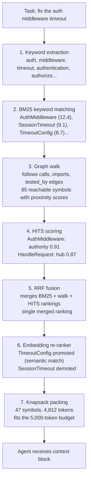

# Introduction to knowing

This guide builds understanding from zero. No assumed background in content-addressing, Merkle trees, or graph theory. By the end you'll understand why knowing exists, how it works, and what makes it different from every other code intelligence tool.

## System at a Glance

knowing is a self-adapting code intelligence engine. It builds a content-addressed graph of code relationships, then observes the structural properties of that graph and adjusts its retrieval strategy accordingly. The full pipeline (keyword search, graph walk, scoring, fusion, packing) runs on every query, but how each step behaves adapts to the graph: on dense, enterprise-scale graphs (40K+ symbols) the system automatically prefers type hierarchies as entry points and increases the number of starting points to compensate for keyword flooding. An optional local embedding gap-fill uses semantic similarity to promote the most relevant symbols from the graph walk's output. No configuration. No mode switches. The system detects its own operating regime and adapts.

It runs entirely on a developer laptop with no paid LLM calls and no cloud API dependencies. The embedding model runs locally via pure Go inference (no Python, no API keys, no charges).

**Coverage:** 23 extractors spanning Go, TypeScript, Python, Rust, Java, C#, Ruby, SQL, Proto, GraphQL, Helm, Kubernetes YAML, Dockerfile, Makefile, CloudFormation, GitLab CI, and .env files. 38 edge types including calls, imports, implements, references, contains, member_of, similar_to, type_hint_of, co_tested_with, accesses_field, reads_env, executes_process, consumes_endpoint, authored_by, handles_route, publishes, subscribes, and more.

**Integrity:** Every node, edge, and snapshot has a SHA-256 hash. A hierarchical Merkle tree organizes edges by package and type, enabling O(packages) diffs and cryptographic proofs of existence and absence.

**Retrieval pipeline:** AI coding agents need relevant code context to work effectively, but codebases are too large to send in their entirety. The retrieval pipeline's job is to take a natural language task description and return the most relevant code symbols, ranked and packed into a token budget. This replaces the grep-read loops that agents normally perform (47% fewer tool calls, 84% fewer tokens in measured usage). The pipeline powers the `context_for_task` MCP tool that agents call to get context in a single request.

The pipeline transforms a natural language task into a ranked set of code symbols through seven stages. We'll trace a single example ("fix the auth middleware timeout") through each one:



### Step 1: Keyword extraction

Pulls search terms from the task description (e.g., "fix the auth middleware timeout" produces `auth`, `middleware`, `timeout`). The language developers use in task descriptions rarely matches the naming in code exactly: the task says "auth" but the code calls it `Authentication` or `authorize`. To bridge this gap, the system expands keywords using a concept thesaurus (`auth` automatically includes `authentication`, `authorize`, `credential`, `session`) and splits compound names like `validateAuthToken` into their parts (`validate`, `Auth`, `Token`) so partial matches still connect.

**Input:** `"fix the auth middleware timeout"` (task description string)
**Output:** `[auth, middleware, timeout, authentication, authorize, session, credential]` (expanded keyword set)

### Step 2: Keyword matching (BM25: Best Match 25, over FTS5: Full-Text Search 5)

Now we need to find which code symbols match those keywords. This is a search problem: we have 100K+ symbols in the graph, each with a name and a docstring, and we need to rank them by how well they match `[auth, middleware, timeout, ...]`.

**FTS5** (Full-Text Search 5) is SQLite's built-in search engine. When a repo is indexed, knowing builds an FTS5 index over every node's name and docstring. This is like a book's index at the back: instead of scanning every page for "auth", you look up "auth" in the index and immediately get a list of pages (nodes) that contain it. Without FTS5, we'd have to scan all 100K+ node names sequentially. With it, the lookup is near-instant.

**BM25** (Best Match 25) is the scoring algorithm that FTS5 uses to rank the results. When FTS5 finds 600 nodes containing "auth", BM25 decides which ones are most relevant. It does this by considering three things: (1) how often the keyword appears in the node's text (more mentions = higher score), (2) how long the node's text is (a match in a short, specific name like `AuthMiddleware` scores higher than a match in a long generic name like `AbstractBaseAuthenticationMiddlewareFactory`), and (3) how rare the keyword is across all nodes (a match on "middleware" is more valuable than a match on "get" because "middleware" appears in fewer nodes). The combination produces a relevance score for each matching node.

The top matches (e.g., `AuthMiddleware`, `SessionTimeout`) are the symbols that look most relevant based on name alone, but they're not enough: the agent also needs to see what calls them, what they call, and what types they share. That's what the next step discovers.

**Input:** `[auth, middleware, timeout, authentication, authorize, session, credential]` (expanded keywords)
**Output:** `AuthMiddleware` (BM25 12.4), `SessionTimeout` (9.1), `TimeoutConfig` (8.7), `AuthorizeRequest` (7.3), `CredentialStore` (6.8) ... (15 seed nodes ranked by keyword relevance)

### Step 3: Graph walk

Discovers the code that keyword search can't find and assigns every symbol a relevance score. Keyword search finds `AuthMiddleware` because the name matches, but the agent also needs `validateToken` (which `AuthMiddleware` calls), `AuthConfig` (the struct it reads), and `test_auth_timeout.py` (the test that covers it). None of those contain "auth" or "timeout" in their names.

The graph walk finds them by following relationships outward from the keyword matches: `calls` edges reach `validateToken`, `imports` edges reach `AuthConfig`, `tested_by` edges reach the test file. As it walks, it accumulates a score for each symbol it visits: symbols reached by short, direct paths from the keyword matches get high scores, while symbols only reachable through long chains of indirect relationships get low scores. The output is a scored list of every reachable symbol, ranked by structural proximity to the task.

Without a check on drift, the walk would follow edges further and further from the task: `AuthMiddleware` calls `validateToken`, which calls `crypto.Hash`, which calls `io.Read`, which calls... eventually you're deep in the standard library, far from anything useful. The restart mechanism prevents this: at each step, the walk has a 20% probability of jumping back to one of the original keyword matches instead of following another edge. This means the walk constantly re-anchors itself to the task. Symbols close to the keyword matches get visited repeatedly (high score), while symbols many hops away get visited rarely (low score). The result is a natural relevance decay: the further a symbol is from the task, the lower it scores.

On large codebases (40K+ symbols), the system automatically uses more starting points and prefers type-level entries (interfaces, structs) over individual functions, because dense graphs dilute probability mass across too many edges.

**Input:** `AuthMiddleware`, `SessionTimeout`, `TimeoutConfig`, ... (15 seed nodes from BM25)
**Output:** `AuthMiddleware` (0.92), `validateToken` (0.71), `AuthConfig` (0.68), `test_auth_timeout.py` (0.44), `HandleRequest` (0.31), ... (85 reachable symbols with proximity scores)

### Step 4: HITS (Hyperlink-Induced Topic Search) scoring

Adds a second opinion on which symbols matter most. The graph walk scored symbols by proximity (how close they are to the keyword matches), but proximity alone can be misleading: a utility function one hop away scores high even if it's called by everything and isn't specific to auth.

HITS (Hyperlink-Induced Topic Search) scores symbols by their role in the call graph. Think of it like reputation:

- An **authority** is a symbol that does important work. Many things depend on it. `AuthMiddleware` is called by 12 different route handlers. It's the thing that actually does the auth work.

- A **hub** is a symbol that knows where the important work happens. It delegates to many authorities. `HandleRequest` doesn't do much itself, but it calls `AuthMiddleware`, then `parseBody`, then `routeToHandler`, then `writeResponse`. It's a coordinator.

The algorithm computes these scores iteratively: start by giving every symbol equal authority and hub scores, then repeatedly update them. A symbol's authority score becomes the sum of the hub scores of everything that calls it (if important coordinators depend on you, you must be important). Its hub score becomes the sum of the authority scores of everything it calls (if you call many important functions, you must be a good coordinator). After several rounds the scores converge.

In our example, `AuthMiddleware` gets high authority, `HandleRequest` gets high hub, and `validateToken` gets moderate authority (called by 3 middleware functions) but low hub (it's a leaf function that calls almost nothing). These scores help distinguish the important symbols from the incidental ones in the next step.

**Input:** the subgraph of 85 reachable symbols and their edges from the graph walk
**Output:** `AuthMiddleware` (authority 0.91, hub 0.12), `HandleRequest` (authority 0.23, hub 0.87), `validateToken` (authority 0.78, hub 0.05), `AuthConfig` (authority 0.65, hub 0.02)

### Step 5: RRF (Reciprocal Rank Fusion)

Solves a problem: we now have three different rankings of the same symbols (BM25 ranked by name match, graph walk ranked by proximity, HITS ranked by structural importance), and they disagree. BM25 thinks `SessionTimeout` is #2 (great name match) but the graph walk has it at #15 (far from the call chain). HITS thinks `HandleRequest` is important (high hub) but BM25 didn't find it at all (no keyword match).

Reciprocal Rank Fusion doesn't look at what the scores mean or how they were computed. It only looks at rank positions. For each symbol, it sums `1 / (k + rank)` across every list the symbol appears in (where k=60 is a constant that prevents the top rank from dominating). A symbol ranked #1 in one list gets `1/61 = 0.016`. A symbol ranked #1 in three lists gets `3 * 0.016 = 0.049`. A symbol ranked #1 in one list but #50 in the others gets `0.016 + 0.009 + 0.009 = 0.034`. This means consistent mediocrity beats one-list dominance, which is the right behavior: a symbol that all three methods agree is relevant is more likely to actually be relevant than one that only keyword search liked.

In our example, `AuthMiddleware` tops all three lists so it stays #1. `validateToken` ranks well in both graph walk (#2) and HITS (#3) so it merges to #2 despite BM25 not finding it. `SessionTimeout` drops from BM25's #2 to merged #7 because neither the graph walk nor HITS ranked it highly.

**Input:** three ranked lists: BM25 (`AuthMiddleware` #1, `SessionTimeout` #2, ...), graph walk (`AuthMiddleware` #1, `validateToken` #2, ...), HITS (`AuthMiddleware` #1, `validateToken` #2, `AuthConfig` #3, ...)
**Output:** `AuthMiddleware` (RRF 0.049), `validateToken` (0.032), `AuthConfig` (0.028), `TimeoutConfig` (0.025), `HandleRequest` (0.019), ... (single merged ranking)

### Step 6: Embedding re-ranker

Gives the ranking a final adjustment using semantic understanding (on by default). Everything up to this point used structural signals (keyword matching, graph proximity, link analysis), but none of those understand what words mean.

Gap-fill seeds use the same embedding model to find semantically similar symbols when keyword matching fails. The re-ranker step (cosine reordering of top-50 candidates) was disabled after per-repo testing showed it hurt 9 of 13 repos. The model auto-downloads on first use (~30MB). Disable with `--no-embeddings`.

**Input:** top 50 from merged ranking + task `"fix the auth middleware timeout"`
**Output:** `AuthMiddleware` (0.049), `TimeoutConfig` (0.031), `validateToken` (0.028), `SessionTimeout` (0.024), `AuthConfig` (0.022), ... (re-ordered: `TimeoutConfig` promoted from #4 to #2, `SessionTimeout` demoted from #7 to #12)

### Step 7: Knapsack packing

Turns the ranking into a context block that fits the agent's token budget. Each symbol has a relevance score (from the merged ranking) and a token cost (how many tokens its source code takes). The packer selects symbols greedily by score-per-token: a 45-token config struct with score 0.028 is more efficient than a 300-token test file with score 0.030. It fills the budget from the top, skipping symbols that would overflow.

In our example with a 5,000-token budget: `AuthMiddleware` (210 tokens, score 0.049) goes in first, then `TimeoutConfig` (45 tokens), `validateToken` (180 tokens), `AuthConfig` (60 tokens), and so on until 47 symbols totaling 4,812 tokens are packed. The agent receives this as a single context block with all the code it needs for the task, replacing what would have been 15+ grep-read tool calls.

**Input:** 50 re-ranked symbols + 5,000-token budget
**Output:** 47 symbols selected totaling 4,812 tokens: `AuthMiddleware` (210 tokens), `TimeoutConfig` (45 tokens), `validateToken` (180 tokens), `AuthConfig` (60 tokens), ... packed as a single context block ready for the agent

For implementation details, see [Retrieval Pipeline](../architecture/retrieval-pipeline.md), [Context Engine](../architecture/context-engine.md), [Embedding Re-ranker](../architecture/embedding-reranker.md), [Context Packing](../architecture/context-packing.md), and [Wire Formats](../architecture/wire-formats.md). If you are getting poor results from the pipeline, see the [CLI Troubleshooting guide](cli.md#troubleshooting) for diagnostic steps.

**Supply chain detection:** Extracts `reads_env` (credential access), `executes_process` (process spawning), and `consumes_endpoint` (network exfiltration) edges. Computes isolation scores for structurally disconnected code. Detects supply chain attack patterns like TanStack/Mini Shai-Hulud (2026) and event-stream (2018) without executing any code.

**Operational characteristics:**
- Daemon mode with file watcher for incremental re-indexing
- Time-to-consistency: 167ms (edit a file, reindex, query finds the new symbol)
- Adjacency cache: 4,717x latency improvement (9s to 2ms on Kubernetes-scale graph)
- Density-adaptive retrieval: auto-detects graph density, adjusts seed selection strategy
- Embedding gap-fill seeds: +11% P@10 improvement, fully local, on by default. Re-ranker disabled (net negative).
- P@10 = 0.189 cold start, 0.284 with compounding (277 tasks, 14 repos, 8 languages)
- Self-adapting compounding: +4.2% P@10 from passive task memory
- Competitive: 2.17x codegraph, 3.44x GitNexus, 3.63x Gortex, 12.6x grep (cold start)
- MCP server interface with 28 tools for agent consumption

## The Problem

### How AI agents work with code today

When an AI coding agent (Claude Code, Cursor, Copilot) needs to understand your codebase, it does this:

1. Reads the file you're editing
2. Greps for related symbols
3. Reads those files
4. Greps again for callers
5. Reads more files
6. Builds a mental model from fragments
7. Writes code
8. Next turn: forgets everything and starts over

This costs tokens, time, and accuracy. The agent spends 60% of its context window re-reading files it saw last turn. It misses relationships that span multiple files or repos. It has no memory of what was useful last time.

### Why files are the wrong unit

Source code is text organized into files. But the *meaning* of code is relationships:

- Function A calls function B
- Type C implements interface D
- Service E publishes to queue F
- Endpoint G was called 10,000 times yesterday

These relationships cross file boundaries, package boundaries, and repository boundaries. No single file contains the information "this change breaks 14 callers in 3 repos." That information lives in the *graph* of relationships between symbols.

When you ask "what's the blast radius of changing this function signature?", the answer isn't in any file. It's in the set of edges pointing TO that function from everywhere else. Concretely, for `BuildHierarchicalTree` in knowing's own codebase:

```
BlastRadius(BuildHierarchicalTree) = {
  e | e.target = BuildHierarchicalTree ∧ e.type = "calls"
} = {
  SnapshotManager.ComputeSnapshot       --calls-->  BuildHierarchicalTree
  cmd/knowing/prove.cmdProve            --calls-->  BuildHierarchicalTree
  cmd/knowing/prove_absent.cmdProveAbsent --calls--> BuildHierarchicalTree
  cmd/knowing/audit.cmdAudit            --calls-->  BuildHierarchicalTree
  mcp/feedback.computeNeighborhoodRoot  --calls-->  BuildHierarchicalTree
  TestBuildHierarchicalTree_Deterministic --calls--> BuildHierarchicalTree
  TestBuildHierarchicalTree_PackageRoots  --calls--> BuildHierarchicalTree
  TestMerkleDiffBenchmark               --calls-->  BuildHierarchicalTree
  TestContextPackAndCommunityRoots      --calls-->  BuildHierarchicalTree
  cache.TestInvalidatePackages          --calls-->  BuildHierarchicalTree
  ... (10+ callers across 5 packages)
}
```

Change `BuildHierarchicalTree`'s signature? Every one of these breaks. No single file contains this information. The edges do.

### What existing tools provide

| Tool | What it knows | What it misses |
|---|---|---|
| **LSP (gopls, pyright)** | References within one workspace | Cross-repo callers, history, runtime behavior |
| **grep/ripgrep** | Text matches | Semantic relationships (string match != function call) |
| **Dependency graphs** | Package-level imports | Function-level callers, routes, runtime traffic |
| **APM (Datadog, etc)** | What happened in production | What the code declares, static blast radius |

None of them version the relationships. None of them can prove a relationship existed at a specific point in time. None of them learn from use.

### The emerging landscape

The AI coding agent era has produced several categories of tools trying to solve the context problem. To understand why knowing exists, it helps to understand exactly how each existing approach works and where it breaks down.

#### Text search (grep/ripgrep)

The baseline. Agents grep for symbol names and read the matching files. ripgrep is extremely fast (sub-second on million-line codebases) and requires no indexing. The limitation is purely semantic: text search cannot distinguish "functions that call this handler" from "comments mentioning the word handle." Searching for "Handle" in a Go codebase returns 10,000+ matches spanning HTTP handlers, file handles, error handling, and variables. The agent burns its context window sorting signal from noise, misses relationships that don't share string literals, and cannot answer structural questions ("what implements this interface?"). Measured: P@10 = 0.013 across 222 tasks.

#### codegraph (21.9K stars, colbymchenry/codegraph)

Builds a code graph using tree-sitter AST parsing across 19+ languages, stored in SQLite with FTS5 full-text search. Exposes MCP tools for symbol search, call tracing, impact analysis, and context retrieval. Uses heuristic scoring (co-location, multi-term matching, CamelCase boundary awareness) rather than graph-theoretic ranking (no RWR, no HITS, no PageRank). Supports incremental auto-sync via native OS file events with 2-second debounce. Deterministic (same output every run). Measured: P@10 = 0.135 (knowing 1.53x better, p=0.0006), but first-result accuracy (MRR 0.459) slightly exceeds knowing's (0.411). Fills positions 2-10 with loosely related symbols via BFS expansion from entry points, producing high recall but low precision. No versioning, no temporal queries, no feedback mechanism.

#### codebase-memory-mcp (2.7K stars, DeusData)

Single-binary MCP server using 155 vendored tree-sitter grammars, BM25 via SQLite FTS5 (with camelCase/snake_case-aware tokenization), and semantic similarity edges computed via bundled nomic-embed-code embeddings (768-dim, int8 quantized). Uses an 11-signal combined scoring system (TF-IDF, reciprocal rank, API/type/decorator signatures, AST profiles, data flow). Deterministic. Works well on small repos (Flask: 285ms/query). Breaks at scale: hangs at 100% CPU on repos exceeding ~22K-46K nodes (Django 300K LOC hangs at >10s/query, VS Code and Kubernetes killed after minutes). No graph walk beyond single-hop neighbor lookup, so transitive relationships (A calls B calls C) are invisible. Measured: P@10 = 0.137 on the repos it can handle (knowing 1.51x better).

#### Aider (~20K stars, paul-gauthier/aider)

Two-phase architecture: a deterministic component builds the "repo map" using tree-sitter to extract symbol definitions and their cross-file references into a dependency graph, then ranks files using a PageRank-like graph algorithm weighted by reference frequency. The map is a concise summary (default 1K tokens) of the most highly-connected symbols. The LLM then uses this map to decide which files to open in full. Non-determinism is moderate (3 unique outputs per 10 runs, likely from PageRank tie-breaking on equi-ranked files). Returns file-level context rather than symbol-level, so even correct selections include irrelevant code within those files. Measured: P@10 = 0.050 (knowing 4.1x better). Cannot find newly added symbols because PageRank requires inbound references; a function with zero callers gets zero weight regardless of name match. Time-to-consistency: 3,150ms (every query rebuilds the map).

#### GitNexus (~40K stars, abhigyanpatwari/GitNexus)

Client-side knowledge graph that indexes codebases using tree-sitter, then runs community detection (clustering related symbols) and execution flow tracing at index time. Exposes 16 MCP tools including hybrid BM25 + semantic search. Does not use LLM calls for core indexing or queries. Non-determinism (7-9 unique outputs per 10 runs of the same query, measured) likely stems from randomized community detection and flow analysis algorithms whose output order varies between runs. All-in-memory JavaScript architecture (single-threaded V8) with no streaming writes: 5.7GB RAM on Kubernetes, killed after 60+ minutes without producing results. On repos it can handle: P@10 = 0.075 (knowing 2.76x better, p=0.0003).

#### Gortex (zzet/gortex)

Go-based in-memory code graph supporting 257 languages via three extraction tiers (bespoke tree-sitter parsers, regex extraction, forest-backed signatures). Parallel indexing. Precomputes depth-3 reach indices for impact analysis and uses hybrid search (BM25 + embeddings + reciprocal rank fusion). Architecturally the most similar competitor to knowing (same stack: Go, tree-sitter, parallel, graph-based). Deterministic. Limitations: re-indexes the graph on every context query (no persistent cache), consumes 14GB RAM on Kubernetes-scale repos, and indexes all files indiscriminately (including tests), which pollutes retrieval results. Measured: P@10 = 0.063 (knowing 3.29x better), 46x slower indexing, and 70x more RAM at enterprise scale.

#### CGC (CodeGraphContext, codegraphcontext)

Stores code structure in a graph database (KuzuDB default, with Neo4j/FalkorDB alternatives). Parses 20 languages via tree-sitter, optionally uses SCIP indexers for C/C++ and C#. Supports caller/callee queries, class hierarchy navigation, and dead code detection. The critical limitation: no task-oriented retrieval. CGC only supports exact name search (`find name`) and regex pattern matching (`find pattern`); natural language queries like "add rate limiting to the handler" return zero results. It is a code navigation tool, not a context retrieval system. Indexing is extremely slow (Flask 15K LOC: 216 seconds vs knowing's 0.1s). Not benchmarkable on the same tasks because it fundamentally does not solve the same problem.

#### The shared failure modes

Across all of these tools, recurring gaps appear:

1. **No multi-hop graph walk.** codegraph, codebase-memory, and CGC support single-hop queries ("who calls X?") but miss transitive structure ("what's the full call chain from the HTTP handler to the database?"). Only Gortex precomputes reachability (depth-3), but re-indexes per query.
2. **No versioning.** All use mutable state. None can answer "who called X last Tuesday?" or prove what the graph looked like at a past commit. Cache validity depends on TTLs or full rebuilds, not content-derived hashes.
3. **No feedback loop.** None learn which results were actually useful to the agent. Every query starts from scratch with no accumulated signal.
4. **Scale ceiling.** codebase-memory hangs above ~150K LOC. GitNexus OOMs above ~1M LOC. Gortex consumes 14GB on Kubernetes. Aider rebuilds the map per query (3s latency). Only codegraph and knowing handle enterprise-scale repos without degradation.
5. **Determinism varies.** codegraph, codebase-memory, and Gortex are deterministic. Aider is moderately non-deterministic (3 unique outputs per 10 runs). GitNexus is wildly non-deterministic (7-9 unique outputs per 10 runs).

#### Where knowing sits

knowing's differentiator is graph-native retrieval: RWR (Random Walk with Restart) + HITS authority scoring + BM25 fusion + embedding gap-fill seeds, producing a single deterministic ranking per query. The same input always yields the same output. The pipeline scales to 253K nodes (Kubernetes) without hanging. It runs locally with no LLM dependency (the embedding model is pure Go ONNX inference, not an LLM), completing in 2ms on cached graphs via the adjacency cache (220ms with embedding gap-fill). And because the graph is content-addressed and Merkle-versioned, every result is reproducible, cacheable, and provable.

**Context packers** (Aider, Repo Map, etc) analyze your repo and produce a condensed map for the agent's context window. They run at query time, produce text, and are stateless: they don't remember what was useful last time. They don't version their output or prove anything about it.

**Code graphs / indexers** (Sourcegraph, codegraph, GitNexus, Stack Graphs) build a queryable index of code relationships. Most use mutable state (database rows with auto-increment IDs). They can answer "who calls X?" but can't answer "who called X last Tuesday?" or "prove no one calls X." They don't learn from feedback. In head-to-head benchmark (14 repos, 277 tasks, 8 languages): knowing achieves 2.10x the precision of codegraph (19K stars), 3.77x vs GitNexus, and 4.49x vs Gortex.

**Agent memory systems** (MemGPT, various RAG frameworks) persist information across sessions. They remember conversations but not code structure. They can recall "you asked about auth last time" but can't tell you "auth's blast radius grew by 3 callers since then."

**Runtime observability** (OpenTelemetry, Datadog, Honeycomb) tracks what actually happens in production. Rich temporal data but disconnected from source code. Knows "service A called service B 10,000 times today" but not "the code that enables this call lives in file X at line 42."

knowing combines elements of all four categories into one system:
- Builds a code graph (like Sourcegraph) but content-addressed and versioned
- Packs context for agents (like Aider) but graph-ranked and cached
- Remembers what was useful (like agent memory) but expires when code changes
- Can ingest runtime traces (like APM) and compare against static analysis
- Does something none of them do: cryptographic proofs of existence and absence

The categories overlap, but no existing tool occupies knowing's exact position: a versioned, provable, learning code graph that serves both agents and auditors from the same foundation.

### How Context Packing Works

The retrieval-to-output pipeline transforms a natural language task description into a ranked, budget-constrained context block. Here is the complete path from input to output.

**Input:** A natural language task description. For example: "add rate limiting to the API handler."

**Step 1: Keyword extraction.**
The task string is parsed into structured keywords. CamelCase and snake_case identifiers are split into components ("rateLimit" becomes ["rate", "limit", "rateLimit"]). Verb synonyms are expanded ("add" includes "create", "insert"). Stop words are removed. The result is a `KeywordSet` with three tiers: Exact (backtick-quoted identifiers), Compounds (multi-word identifiers preserved whole), and Components (individual words, used only as fallback). This tiered structure ensures that "rateLimit" is searched as a whole identifier before "rate" and "limit" are searched independently.

**Step 2: Tiered search.**
The keywords are matched against the graph's node index using a priority cascade:

1. Exact qualified name match (highest priority): the full identifier matches a node's `qualified_name` field directly.
2. BM25 full-text search: compound keywords are run through the FTS5 index, scoring by term frequency and document length normalization.
3. Equivalence class expansion (lowest priority): if a matched symbol has `similar_to` edges (embedding-based similarity), those neighbors are included as additional candidates.

Each tier runs only if the previous tier produced fewer than the minimum seed count. This prevents low-specificity component words from flooding results when high-specificity compound matches exist.

**Step 3: Seed selection.**
The top-K candidates from tiered search (typically 5-15 symbols) become the "seeds" for the graph walk. Seeds are weighted by which tier matched them: exact matches get weight 1.0, BM25 matches get weight proportional to their FTS score, equivalence expansions get weight 0.5. These weights become the restart distribution for the random walk.

**Step 4: Random Walk with Restart (RWR).**
Starting from the weighted seed set, simulate a random walk across the graph. At each step:
- With probability (1 - alpha), follow a random outgoing edge to a neighbor. Edge types are weighted: `calls` edges have higher transition probability than `similar_to` edges.
- With probability alpha (default 0.2), restart by jumping back to a seed (chosen proportional to seed weights).

The walk converges to a stationary distribution where each node's probability reflects its structural relevance to the seeds. Nodes reachable by short paths from many seeds accumulate high probability. Nodes far from seeds or reachable only through long chains get negligible probability. Community-aware constraint: when all seeds cluster in a single detected community, the walk is restricted to that community's subgraph, preventing drift into unrelated code.

**Step 5: HITS authority/hub scoring.**
On the top-K nodes from RWR (typically top 50-100), run the HITS algorithm. This separates nodes into two roles:
- Authorities: nodes pointed to by many other nodes (heavily-called functions, core types). High authority score means "this symbol is important to the task."
- Hubs: nodes that point to many other nodes (orchestrators, routers, main functions). High hub score means "this symbol connects task-relevant code."

The authority score is used for ranking in most retrieval scenarios (agents typically need the called code, not the callers).

**Step 6: RRF fusion (Reciprocal Rank Fusion).**
Three ranked lists now exist: (1) tiered search ranking, (2) RWR stationary distribution ranking, (3) HITS authority ranking. RRF merges them into one final ranking using the formula:

```
score(symbol) = sum over all lists L of: 1 / (k + rank_in_L(symbol))
```

where k=60 (standard RRF constant). This fusion is robust to outliers in any single ranker: a symbol must rank well in multiple signals to reach the top. The result is a single ordered list of symbols sorted by combined relevance.

**Step 7: Budget-constrained packing.**
The final ranked list is packed into a token budget (default 50,000 tokens) using a knapsack algorithm. For each symbol, the cost is estimated by its source snippet length (lines of code at definition site). The packer walks the ranked list top-to-bottom, including each symbol if it fits within the remaining budget, skipping symbols that would exceed the ceiling. The result is the maximum-relevance subset that fits within the agent's context window.

**Output:** A context block in GCF (Graph Context Format) wire format containing:
- Ranked symbols with their qualified names, file paths, line numbers, and relevance scores
- Source code snippets for each included symbol
- Edge metadata showing relationships between included symbols
- Total token count and budget utilization percentage

This block is ready for direct injection into an agent's context window.

**Key performance characteristic:** On a warm graph with the adjacency cache populated, the entire pipeline (steps 1-7) completes in 2ms. The adjacency cache precomputes neighbor lookups for all nodes, eliminating random I/O during the graph walk. This makes it practical to run the pipeline on every agent turn without adding perceptible latency.

## What a Code Graph Is

### Why a graph, not a tree

A tree enforces one parent per node. File systems are trees: every file has exactly one directory. But code relationships violate this constantly:

- A function is called by **12 different callers** (12 inbound edges, not 1 parent)
- A type implements **3 interfaces** simultaneously
- A service publishes to a queue AND handles HTTP routes AND connects to a database
- A symbol in repo A is called by repos B and C (cross-repo fan-in)
- Runtime traces show a call path that static analysis doesn't see (multiple views of the same relationship)

You can't represent "function X is called by A, B, and C, implements interface D, handles route /users, and was observed calling external service E" in a tree without duplicating nodes or losing edges. A graph stores all of these naturally: multiple inbound edges, multiple outbound edges, multiple types, no structural constraint.

The Merkle tree is layered ON TOP of the graph for integrity and efficient querying. It doesn't constrain the graph's topology. The tree organizes edges by package and type; the graph stores the actual multi-directional relationships.

### Structure

A code graph has two things:

**Nodes** are symbols: functions, methods, types, interfaces, variables, routes, database tables, queue topics, config keys.

**Edges** are relationships between symbols: calls, imports, implements, references, handles_route, publishes, subscribes, connects_to.

```
[OwnerController.createOwner] --calls--> [OwnerRepository.save]
[OwnerController.createOwner] --handles_route--> [POST /owners/new]
[OwnerRepository] --implements--> [Repository interface]
```

Every entity in the graph is content-addressed via SHA-256. The hash formulas (covered in detail in the next section) are:

- **Node hash** = `sha256("node\0" + repoURL + packagePath + qualifiedName + kind)`
- **Edge hash** = `sha256("edge\0" + sourceHash + targetHash + edgeType + provenance)`
- **File hash** = `sha256(file content)`
- **Snapshot hash** = Merkle root of all edge hashes (hierarchical tree over the full graph)

This means identity is derived from content. Same relationship on any machine produces the same hash. Different relationship produces a different hash. No assigned IDs, no coordination, no ambiguity.

### Node metadata

Each node carries:

| Field | Description |
|---|---|
| `qualified_name` | Fully qualified symbol name (e.g., `github.com/org/repo/pkg.FuncName`) |
| `kind` | Symbol type: function, method, type, interface, variable, route, table, topic, config |
| `file_hash` | SHA-256 of the file content at time of indexing; changes when the file changes |
| `line` | Line number in the source file where the symbol is defined |
| `signature` | Type signature or function prototype (language-dependent) |
| `last_author` | Git blame author of the line where the symbol is defined |
| `last_commit_ts` | Timestamp of the most recent commit touching the symbol's definition |

The file hash links a node to a specific file state. When a file is re-indexed, its new hash is compared against the stored hash. If they differ, all nodes in that file are re-extracted. If they match, the file is skipped entirely (no re-parsing needed).

### Edge metadata

Each edge carries:

| Field | Description |
|---|---|
| `type` | Relationship kind: calls, imports, implements, references, similar_to, co_tested_with, type_hint_of, accesses_field, reads_env, executes_process, etc. (38 types total) |
| `confidence` | Float 0.0 to 1.0 indicating certainty of the relationship |
| `provenance` | Discovery method: `ast_inferred`, `lsp_resolved`, `git_blame`, `similarity`, `runtime` |
| `file` | Source file where the call site exists |
| `line` | Line number of the call site |
| `col` | Column number of the call site |

The call site location (file, line, col) lets consumers jump directly to where the relationship is expressed in source code.

### Provenance tiers

Provenance is not just a label; it implies a confidence floor:

| Provenance | Confidence floor | Meaning |
|---|---|---|
| `ast_inferred` | 0.7 | Tree-sitter parsed the syntax and inferred a relationship. No type resolution. May be wrong if a local variable shadows a package name. |
| `lsp_resolved` | 0.9 | A language server (gopls, pyright, rust-analyzer) resolved the call site to a concrete symbol with full type information. Nearly certain. |
| `runtime` | 1.0 | Observed in production via OpenTelemetry trace or runtime instrumentation. The relationship definitely exists at runtime. |
| `git_blame` | 0.8 | Derived from git history (authored_by edges, temporal co-change). Reliable but reflects past state. |
| `similarity` | 0.6 | Embedding-based similarity detected structural resemblance. Useful for discovery, not proof. |

When a higher-tier extractor confirms a relationship already found by a lower-tier extractor, the confidence is upgraded in place. The edge hash remains the same (same source, target, type, provenance), but the mutable confidence field reflects the stronger signal. Consumers can filter by confidence threshold to control precision vs. recall.

### Snapshots and the snapshot chain

Each index run produces a new **snapshot**. A snapshot is a single hash (the Merkle root of all edge hashes in the hierarchical tree) tied to a git commit SHA. It represents the complete state of the graph at that point in time.

The snapshot chain is the sequence of snapshots across index runs:

```
Snapshot S1 (commit abc123) -> Snapshot S2 (commit def456) -> Snapshot S3 (commit 789ghi)
```

Diffing two snapshots reveals exactly what changed between them: new edges added, edges removed, confidence upgrades. The diff is O(packages) because only packages with differing Merkle roots need investigation (see the hierarchical tree section below).

This enables:
- **Incremental processing:** only re-process files whose hashes changed since the last snapshot.
- **Temporal queries:** "when did this call edge first appear?" Walk the snapshot chain backward.
- **Audit trails:** "prove the graph state at commit X." The snapshot hash is the proof anchor.

### Edge events

Every edge creation and deletion is recorded as a timestamped **event**:

```
{ action: "created", edge_hash: "7b3c...", snapshot: "S2", timestamp: "2024-01-15T10:32:00Z" }
{ action: "deleted", edge_hash: "a27e...", snapshot: "S3", timestamp: "2024-01-16T08:11:00Z" }
```

Edge events enable temporal analysis: "when did service A stop calling service B?", "how many new call edges appeared in the last week?", "which edges are churn-heavy (created and deleted repeatedly)?" The event log is append-only; events are never modified after creation.

### Why content-addressing matters (summary)

The content-addressed design gives four structural properties that pervade the system:

1. **Deduplication.** The same symbol or relationship, discovered by multiple extractors or across multiple index runs, produces the same hash. Store once, reference everywhere.
2. **Integrity verification.** Recompute any hash from its inputs. If it matches, the data is uncorrupted. This works recursively up to the snapshot root.
3. **Incremental diffing.** Compare two snapshot hashes: if equal, nothing changed. If different, walk the tree to find exactly what changed. No full scans.
4. **Merkle proofs for audit trails.** Any edge's existence (or absence) in a snapshot can be proven with a small proof file (under 1KB) that verifies offline using only SHA-256.

The next section ("Why Content-Addressing") covers the mechanics in depth: domain prefixes, worked examples, cache implications, and what happens when extractors are wrong.

The graph represents what your codebase *understands about itself*: who calls what, who depends on what, what routes exist, what runtime traffic looks like.

### Edges are the intelligence, nodes are the vocabulary

Both nodes and edges are stored, content-addressed, and queryable. But the Merkle tree (the versioning structure) is built from **edges**, not nodes. This is deliberate.

A node's existence rarely changes: functions get added or removed occasionally. But relationships change constantly: new callers appear, imports shift, runtime traffic patterns evolve, dependencies get added or removed. The edge set is where the interesting changes happen.

If you built the tree from nodes, "did anything change?" would mean "was a symbol added or removed?" That's a coarse signal. Building from edges means "did any relationship change?" which captures: new callers, removed dependencies, changed routes, different runtime traffic. Every downstream operation (diff, cache invalidation, proofs, blast radius) cares about relationships, not symbol existence.

Think of it this way: knowing that `CreateOwner` exists tells you almost nothing. Knowing that `CreateOwner` calls `save`, handles `POST /owners/new`, is called by 3 controllers, and was observed 10K times in production: that's the intelligence. The edges carry the meaning. The nodes are just anchor points.

## Why Content-Addressing

### The idea

In a normal database, data has an ID assigned by the system (auto-increment, UUID). The ID is arbitrary: it has no relationship to the content. You could swap the content and keep the ID and nothing would detect it.

In a content-addressed system, the ID IS the content. Specifically, it's a cryptographic hash (SHA-256) of the content.

**What's a cryptographic hash?** A function that takes any input (a byte, a file, a sentence) and produces a fixed-size output (32 bytes for SHA-256). Two key properties:

1. **Deterministic.** Same input always produces the same output. Always. On any machine.
2. **Collision-resistant.** Two different inputs producing the same output is so unlikely (1 in 2^256) that we treat it as impossible.

This means: if you know the hash, you know exactly what the content must be. If the content changes by even one bit, the hash changes completely (the "avalanche effect").

### Domain prefixes: preventing cross-type confusion

knowing hashes four types of things: nodes, edges, snapshots, and Merkle tree interior nodes. Without care, a node hash could accidentally match an edge hash (different data that happens to SHA-256 to the same value). To prevent this, every hash computation starts with a domain prefix:

```
NodeHash     = SHA-256("node\0"     + repoURL + packagePath + symbolName + symbolKind)
EdgeHash     = SHA-256("edge\0"     + sourceHash + targetHash + edgeType + provenance)
SnapshotHash = SHA-256("snapshot\0" + merkleRoot)
MerkleNode   = SHA-256("merkle\0"   + leftChild + rightChild)
```

The `\0` (null byte) separates the prefix from the data. This is the same pattern git uses: git hashes files as `"blob <size>\0<content>"`. The prefix makes it structurally impossible for a node hash to collide with an edge hash, because their inputs always start with different bytes.

### The four hashed entity types

knowing's content-addressed universe consists of exactly four types. The first three (nodes, edges, snapshots) are **domain objects**: they represent code and its relationships. The fourth (Merkle interior nodes) is **structural**: it exists solely for efficient verification and diffing, not to represent any code entity.

#### 1. Nodes

**Hash formula:** `sha256("node\0" + repoURL + qualifiedName + kind)`

A node represents a code symbol: a function, type, method, variable, route, table, or topic. The hash uniquely identifies this symbol across all repositories. Two developers indexing the same repo at the same commit produce the same node hashes because identity is derived entirely from the symbol's location and kind. Renaming a function or moving it to a different package produces a new hash (it is now a different node).

#### 2. Edges

**Hash formula:** `sha256("edge\0" + sourceHash + targetHash + edgeType + provenance)`

An edge represents a relationship between two nodes: calls, imports, implements, references, similar_to, authored_by, and 24 others. The provenance (discovery method) is part of the hash because the same relationship discovered by different methods (tree-sitter vs LSP vs runtime trace) produces different edges with different confidence levels. This is intentional: a tree-sitter guess at confidence 0.7 and an LSP confirmation at confidence 0.9 are tracked as the same edge (same source, target, type, provenance category), but a runtime-observed call is a distinct edge from a statically-inferred one, because the evidence is fundamentally different.

#### 3. Snapshots

**Hash formula:** Merkle root of all edge hashes in the repository at index time.

A snapshot represents the complete state of a repository's graph at a point in time. It is the top of the Merkle tree: one 32-byte value that summarizes every relationship in the repository. Comparing two snapshot hashes tells you instantly whether anything changed (O(1) equality check). If they match, the entire graph is identical. If they differ, you descend the tree to find what changed. Each snapshot is tied to a git commit SHA, creating an auditable chain of graph states over time.

#### 4. Merkle tree interior nodes

**Hash formula:** `sha256("merkle\0" + leftChildHash + rightChildHash)`

These are NOT code entities. They exist only for integrity verification and efficient diffing. The tree is hierarchical: leaves are edge hashes (Level 1), Level 2 groups edges by package into subgraph roots, and Level 3 is the repository root (the snapshot hash). Interior nodes enable O(log n) diff: to find which packages changed between two snapshots, compare Level 2 hashes; only descend into children that differ. This is how knowing achieves 167ms time-to-consistency: it does not recompute unchanged packages. Interior nodes also provide the sibling hashes needed for Merkle inclusion and absence proofs.

#### Summary

| Type | Hash inputs | Represents | Purpose |
|---|---|---|---|
| **Node** | repoURL + qualifiedName + kind | A code symbol | Unique identity for any symbol across all repos |
| **Edge** | sourceHash + targetHash + edgeType + provenance | A relationship between symbols | Track every connection, with provenance-aware deduplication |
| **Snapshot** | Merkle root of all edges | Complete graph state at a point in time | O(1) change detection, audit anchoring, cache keys |
| **Merkle interior node** | leftChildHash + rightChildHash | Nothing in the domain (structural only) | O(log n) diffing, proof generation, scoped cache invalidation |

The key architectural insight: nodes, edges, and snapshots model the problem domain (code and its relationships). Merkle interior nodes model the verification and query optimization structure layered on top. Consumers of the graph interact with the first three; the fourth is invisible infrastructure that makes the system fast and provable.

### A worked example

Say you have a function `CreateOwner` in package `petclinic/owner` in repo `github.com/spring-projects/spring-petclinic`:

```
Input:  "node\0" + "github.com/spring-projects/spring-petclinic"
                  + "org.springframework.samples.petclinic.owner"
                  + "CreateOwner"
                  + "method"

Output: a27eac262d3e6a8f7c59a220cec65ce426bcdae95f14f0b24007e0312f87fc03
```

That 64-character hex string (32 bytes) is the node's permanent identity. If you rename the function, the hash changes. If you move it to a different package, the hash changes. If everything stays the same, the hash stays the same. On any machine, forever.

Now say `CreateOwner` calls `OwnerRepository.save`. The edge hash:

```
Input:  "edge\0" + a27eac26...  (CreateOwner's hash)
                  + f891bb04...  (save's hash)
                  + "calls"
                  + "ast_inferred"

Output: 7b3c910f4d82a1e5...
```

The edge's identity is derived from WHAT it connects (source + target hashes), HOW (edge type), and WHO discovered it (provenance). Same relationship = same hash. Different relationship = different hash.

### Why this matters

This single design choice gives you six properties for free:

**1. Staleness detection without scanning.**
A file changed? Recompute its nodes' hashes. Any hash that differs from what's stored means that node changed. You know exactly what's stale without scanning the entire graph. The changed hashes propagate: edges FROM those nodes are suspect. Edges TO those nodes from unchanged code are still valid.

**2. Caching without invalidation logic.**
A query result computed against snapshot hash X is valid forever for X. The hash is the cache key AND the validity check. No TTLs. No background invalidation threads. No "maybe this is stale." If the hash matches, the result is correct. Period.

**3. Integrity verification.**
Recompute the hash from the stored data. If it matches the stored hash, the data is uncorrupted. If it doesn't, someone (or something) modified the data after it was indexed. This works recursively: verify one edge's hash, then verify the tree node above it, all the way to the root. One root hash verifies the entire graph.

**4. Determinism.**
Same source code + same analyzer version = same hashes. On any machine, at any time, by any operator. Two people who independently index the same repo at the same commit get the same snapshot hash. CI and local development produce identical graphs. There is no "it indexed differently on my machine."

**5. Efficient equality.**
"Did the graph change?" is a single 32-byte comparison (compare two snapshot hashes). Not a full scan. Not a diff. One `==` operation. O(1). This matters when you're checking cache validity thousands of times per second.

**6. Natural deduplication.**
The same symbol appearing in two contexts (e.g., a function called from 50 places) gets the same node hash. Store it once. Reference it 50 times by hash. The hash IS the pointer.

### What happens when the extractor is wrong

Confidence scores exist because extractors make mistakes. When tree-sitter parses `auth.Login()` it doesn't know if `auth` is an imported package, a local variable, or a struct field. It infers "probably a call to something named Login in something named auth" at confidence 0.7.

Later, if the LSP server (gopls, pyright) resolves the same call site to a specific function with full type information, the edge gets upgraded to confidence 0.9-1.0. The edge hash stays the same (same source, target, type, provenance). Only the mutable confidence metadata changes.

If the extractor is completely wrong (infers a call that doesn't exist), the edge will have confidence 0.7 and no LSP confirmation. Over time, if nobody queries it and nobody confirms it, it sits there as low-confidence data. `knowing fsck` won't flag it (referential integrity is intact). But ranking will deprioritize it: low-confidence edges carry less weight in graph walks.

**The system tolerates noise but prefers signal.** Confidence is the mechanism that separates tree-sitter guesses from LSP confirmations from SCIP proofs from runtime observations. A consumer can filter by confidence threshold.

### How git uses the same idea

Git is the original content-addressed system for developers. A commit hash summarizes the entire repository state. If a single byte changes in any file, the commit hash changes. You verify integrity by checking the root hash.

But git content-addresses *file contents*. knowing content-addresses *relationships between code*. Git can tell you "file auth.go changed." knowing can tell you "3 new callers of ValidateToken appeared, the blast radius of SessionHandler grew by 2, and the call edge to DeprecatedAuth was removed."

## Why Hierarchical

### The limitation of flat hashing

A flat content-addressed system can tell you "something changed" (the root hash is different). But it can't tell you WHAT changed without scanning everything.

Imagine you have 100,000 edges in your graph. Something changed. Which edge? With a flat hash, you compare all 100,000 edges between the old and new state. That's O(edges). At Kubernetes scale (614K edges), this takes seconds. For a CI pipeline that runs on every push, seconds add up.

### The hierarchical tree

knowing organizes edges into a three-level Merkle tree. Each level serves a distinct purpose:

**Level 1: Edge level (leaves).** Individual edge hashes form the leaves of the tree. Each edge hash is computed as `sha256("edge\0" + sourceHash + targetHash + edgeType + provenance)`. These are the atomic units of the graph; every relationship between two symbols is one leaf.

**Level 2: Package/subgraph level (interior).** All edges belonging to a single package are grouped by edge type, then hashed into a **subgraph root** (also called the package root). This root is a single 32-byte hash that summarizes every relationship within that package. If any edge in the package changes (added, removed, or replaced), the subgraph root changes. If nothing in the package changes, the subgraph root is identical. This level is what enables per-package diffing and per-package cache invalidation.

**Level 3: Repository level (root).** All subgraph roots (one per package) are sorted and hashed into a single **repository Merkle root**. This is the snapshot hash. One 32-byte value represents the entire graph state. Comparing two repository roots is O(1); if they match, nothing changed anywhere. If they differ, descend to Level 2 to find which packages changed, then to Level 1 to find which edges changed.

The three levels correspond to three granularities of operation:
- **Edge granularity:** prove a specific relationship exists or doesn't exist.
- **Package granularity:** invalidate caches, scope diffs, expire feedback, compute blast radius for one package.
- **Repository granularity:** verify entire graph integrity, compare snapshots, anchor audit proofs.

```
Level 3 (repository root)
repo root = SHA-256("merkle\0" + left_child + right_child)  [of sorted package roots]
  |
  +-- Level 2 (package/subgraph roots)
  |   package root [internal/auth] = merkle(sorted edge-type roots)
  |     |
  |     +-- edge-type root [internal/auth:calls] = merkle(sorted edge hashes)
  |     |     |
  |     |     +-- Level 1 (edge leaves)
  |     |     +-- edge hash: a27e...  (CreateOwner -> save)
  |     |     +-- edge hash: b91f...  (CreateOwner -> validate)
  |     |     +-- edge hash: c44d...  (ListOwners -> findAll)
  |     |
  |     +-- edge-type root [internal/auth:imports] = merkle(sorted edge hashes)
  |           |
  |           +-- edge hash: d55e...  (auth -> repository)
  |
  +-- package root [internal/store] = merkle(sorted edge-type roots)
        |
        +-- edge-type root [internal/store:calls] = merkle(sorted edge hashes)
              |
              +-- edge hash: e66f...  (save -> db.Exec)
              +-- edge hash: f77a...  (findAll -> db.Query)
```

Within Level 2, edges are further grouped by edge type (calls, imports, implements, etc.) before being Merkle-hashed. This adds a sub-level that allows even finer diffing: "package X changed, specifically its `calls` edges, not its `imports` edges." In practice this means you can determine not just which package was affected but what kind of relationship changed.

**How interior nodes are computed:**

Each interior node is `SHA-256("merkle\0" + left_child_hash + right_child_hash)`. Leaves are the raw edge hashes. If there's an odd number of children, the last one is paired with itself (standard Merkle tree padding).

The leaves at each level are sorted by `bytes.Compare` before tree construction. This makes the root deterministic regardless of insertion order: same edges = same root, always.

**Per-package diffing in practice:**

Because each package has its own subgraph root, diffing two snapshots only requires comparing subgraph roots (one comparison per package). Only packages whose subgraph roots differ need deeper investigation. For a repository with 500 packages where 3 changed, the diff algorithm performs 500 hash comparisons at Level 2, then drills into only those 3 packages at Level 1. The other 497 packages are proven unchanged by a single `==` on their 32-byte root.

This same property enables integrity proofs at any granularity:
- Prove a single edge exists: inclusion proof from leaf to repository root (~16 hash steps).
- Prove a package is unchanged: compare its subgraph root against a trusted snapshot (1 comparison).
- Prove the entire graph is intact: recompute the repository root from all subgraph roots and compare (O(packages)).

### Worked example: detecting a change

Suppose someone adds a new call edge in `internal/auth` (a new function calls `validate`). Here's what changes:

```
Before:
  edge-type root [internal/auth:calls] = merkle(a27e, b91f, c44d) = X
  package root [internal/auth] = merkle(X, imports_root) = P
  repo root = merkle(P, store_root) = R

After (new edge e88b added):
  edge-type root [internal/auth:calls] = merkle(a27e, b91f, c44d, e88b) = X'  (CHANGED)
  package root [internal/auth] = merkle(X', imports_root) = P'  (CHANGED, because X changed)
  repo root = merkle(P', store_root) = R'  (CHANGED, because P changed)
```

The change cascades up. But notice: `store_root` didn't change. `internal/store`'s package root is identical. Any cached computation scoped to `internal/store` is still valid.

**The diff algorithm:**
1. Compare repo roots: R != R'. Something changed.
2. Compare package roots: P != P' (auth changed), store_root == store_root (store didn't).
3. For changed packages, compare edge-type roots: X != X' (calls changed), imports_root == imports_root.
4. Only drill into the changed edge-type to find the specific new edge.

Steps 1-3 are O(packages). Step 4 is O(edges in that one edge-type). Total work: proportional to what changed, not to the total graph size.

### What this enables

**O(packages) diff instead of O(edges):**
"What changed?" Compare package roots. Only packages with different roots need investigation. For a 100,000-edge graph with 500 packages where 3 changed, that's 500 comparisons instead of 100,000. Benchmarked: 565x faster at 100K edges.

**Semantically meaningful output:**
The diff doesn't say "edge at position 47,832 changed." It says "package `internal/auth` changed, specifically the `calls` edges." That's actionable information. You can route it to the auth team. You can scope your cache invalidation to auth callers only.

**Scoped cache invalidation:**
Your cached blast-radius result for `internal/store` is still valid even though `internal/auth` changed. The package root for `internal/store` didn't change, so anything computed from it is still correct. The cache key IS the package root. When you check "is my cache valid?", you compare one 32-byte hash. 42 nanoseconds.

**Subgraph queries:**
"Give me a single hash that represents the state of these 5 packages." That's a `SubgraphRoot` computation: sort the 5 package roots, build a Merkle tree over them. Use it as a cache key, a validity check, or a proof anchor. 1.5 microseconds at Grafana scale.

### How proofs work (mechanically)

An inclusion proof answers: "Prove that edge X exists in the tree rooted at R."

The proof is a path from the leaf (edge hash) to the root, plus the sibling hashes at each level that let a verifier reconstruct the root:

```
Edge hash: a27e...
Level 1 (leaf -> edge-type root):
  Step 1: sibling = b91f..., direction = right   (I'm left, sibling is right)
  Step 2: sibling = c44d..., direction = right   (I'm left at next level)
  ... (log2(edges_in_this_type) steps)

Level 2 (edge-type root -> package root):
  Step 1: sibling = imports_root, direction = right
  ... (log2(edge_types_in_package) steps)

Level 3 (package root -> repo root):
  Step 1: sibling = store_root, direction = right
  ... (log2(packages) steps)
```

**What the verifier does:**
1. Start with the edge hash.
2. At each step, combine with the sibling: `SHA-256("merkle\0" + me + sibling)` (or sibling + me, depending on direction).
3. The result becomes the input for the next step.
4. After all steps, the final value should equal the claimed root.
5. If it does: the edge is proven to exist in this tree. If it doesn't: the proof is invalid.

The verifier needs: the edge hash, the proof steps (sibling hashes + directions), and the expected root. Nothing else. No database. No network. Just SHA-256.

**Total proof size:** ~16 steps for a graph with 13K edges (log2 at each of 3 levels). Each step is 33 bytes (32-byte hash + 1-byte direction). Total: ~660 bytes + metadata. The proof is a self-contained JSON file.

### How absence proofs work

An absence proof answers: "Prove that edge X does NOT exist in the tree."

The mechanism: leaves are sorted. If edge X doesn't exist, there must be two adjacent leaves A and B such that A < X < B (in byte order). If you can prove A is in the tree, prove B is in the tree, and show they're adjacent (no room between them), then X cannot be there.

```
Sorted leaves: ... a27e, b91f, c44d, e88b, f77a ...

Missing edge hash: d55e...

Left neighbor:  c44d... (largest leaf < d55e)
Right neighbor: e88b... (smallest leaf > d55e)

Proof: two inclusion proofs (one for c44d, one for e88b) against the same root.
```

The verifier checks:
1. Left neighbor proof verifies against the root.
2. Right neighbor proof verifies against the root.
3. Left < missing < right (byte order).
4. Left and right are adjacent in the tree (no leaf between them).

If all four pass: the missing edge cannot exist in this tree. The sorted structure guarantees it.

This is the same principle Certificate Transparency uses to prove a certificate was never issued. Applied to code relationships.

## What knowing Does With This

### 1. Context Engine (for AI agents)

Instead of grep-read-grep-read, one call:

```bash
knowing context -task "refactor auth middleware" -format gcf
```

**What happens inside that call:**

**Step 1: Keyword extraction.**
Parse the task description into a `KeywordSet` with three tiers: Exact (backtick-quoted identifiers like `before_request`), Compounds (snake_case, CamelCase, dotted identifiers found in the text), and Components (individual split words, used as fallback). Expand abbreviations ("auth" -> "authentication", "authorize"). Filter stop words. Generate bigram compounds from adjacent words (e.g., "auth" + "middleware" -> "auth_middleware"). The structured set ensures compound identifiers are queried first, preventing split fragments from drowning out the actual symbol names.

**Step 2: Seed selection (compound-first tiered search).**
Find symbols in the graph using a tiered search strategy that respects the KeywordSet structure:
1. Tier 1: Exact match on Exact + Compound keywords (full identifier match)
2. Tier 2: Prefix match on Exact + Compound keywords (symbol name starts with compound)
3. Fallback to Components only when Tiers 1-2 yield fewer than 5 results

This prevents "before" and "request" from filling results before "before_request" is found. Each matched symbol becomes a "seed" for the graph walk, weighted by which tier matched it.

**Step 3: Random Walk with Restart (RWR).**
Starting from the seeds, simulate a random walk on the graph. At each step, either follow an edge to a neighbor (probability 0.8) or "restart" by jumping back to a seed (probability 0.2, i.e., alpha=0.2). Repeat for many steps. The probability of landing on each node after convergence is its "relevance score." Community-aware filtering: when all seeds cluster in a single community, the walk is constrained to that community, producing more focused results.

Intuition: symbols that are close to many seeds (reachable by short paths) get high scores. Symbols that are far away or only reachable through long chains get low scores. The restart probability prevents the walk from drifting too far from the task.

**Step 4: HITS reranking.**
On the top-K results from RWR, run the HITS algorithm (Hyperlink-Induced Topic Search). This separates "hubs" (symbols that call many things) from "authorities" (symbols that are called by many things). For a refactoring task, authorities matter more (the things being called). For a wiring task, hubs matter more (the connectors).

**Step 5: Feedback boost.**
Feedback boost is computed as `0.5 + recall_score * 0.4`, where recall_score comes from task memory (top-5 symbols stored per query). Feedback automatically expires when the package's SubgraphRoot changes (code was modified). This is how the system learns over time without accumulating stale signals.

**Step 6: Token budget packing.**
The ranked symbols are packed into the token budget (default 50,000 tokens) using a knapsack algorithm: maximize total relevance score within the budget constraint. Larger symbols (more edges, longer signatures) cost more tokens. The packer selects the combination that maximizes information density.

**Result:** 85-200 symbols, ranked by graph relevance, packed into a budget. One call. No grep loops.

The results improve with use: feedback records which symbols were actually useful, and that signal compounds across sessions while automatically expiring when code changes.

### 2. Audit Primitive (for compliance)

```bash
knowing prove -source "PaymentService" -target "UserDB" -type calls -human
```

Generates a cryptographic Merkle proof that a relationship exists (or doesn't exist) at a specific git commit. The proof is 3KB of JSON. It verifies offline without database access. An auditor needs only the proof file and a SHA-256 implementation.

This is something no other code intelligence tool can do. Proving a negative ("service A does NOT call service B") requires sorted leaf adjacency proofs: you prove the two neighbors that bracket the gap, demonstrating there's no room for the missing edge.

### 3. Memory Layer (that learns)

**The problem with persistent feedback:**
If you record "symbol X was useful" and then completely rewrite X, the old feedback is now wrong. It points at code that no longer exists in the same form. Over time, a system that never expires feedback accumulates noise: stale positive signals for code that has been rewritten, reorganized, or deleted.

**Merkleized feedback validity:**
When you mark a symbol as "useful," the feedback record stores two things:
1. The symbol's hash (what was useful)
2. The SubgraphRoot of the symbol's package at that moment (what the surrounding code looked like)

The SubgraphRoot is the Merkle root of all edges in that package. It changes when any edge in the package changes (a function is added, renamed, or deleted).

**Automatic expiration:**
When querying feedback later, knowing compares the stored SubgraphRoot against the CURRENT SubgraphRoot for that package. If they differ (code changed), the feedback is invisible. If they match (code is the same), the feedback applies.

```
Record feedback:
  symbol_hash: a27e...
  useful: true
  neighborhood_root: 9dc3...  (SubgraphRoot of internal/auth at this moment)

Query feedback later:
  Current SubgraphRoot of internal/auth = 9dc3...  (matches! feedback valid)

After code changes:
  Current SubgraphRoot of internal/auth = f891...  (doesn't match! feedback expired)
```

No manual cleanup. No TTLs. No background jobs. The Merkle root IS the validity check. Same mechanism as caching, applied to feedback.

**Why this matters at scale:**
After 1,000 sessions of agent feedback, the system has thousands of signal records. Without expiration, old signals from rewritten code would pollute current rankings. With merkleized expiration, only signals from code that's still in its current form apply. The system can run for years and get smarter without getting noisier.

**Measured impact:** Precision improves from 16% to 50% over 5 rounds of feedback. The improvement is immediate (first round = +20pp) and sustained (doesn't degrade in subsequent rounds). The 11% overhead of checking neighborhood roots (255us -> 284us per 100 symbols) is negligible compared to the retrieval benefit.

## How It Fits Together

```
Source code (files)
    |
    v
Daemon (file watcher, incremental re-indexing, 167ms time-to-consistency)
    |
    v
Extractors (23 extractors: tree-sitter, LSP, SCIP, YAML/config parsers)
    |
    v
Code Graph (nodes + edges + provenance + confidence)
    |
    v
Hierarchical Merkle Tree (repo -> packages -> edge-types -> leaves)
    |
    v
Snapshot (one hash = entire graph state, tied to git commit)
    |
    +--> Context Engine (ranked retrieval for agents, cross-repo identity)
    +--> Proof System (inclusion + absence proofs, offline verifiable)
    +--> Diff Engine (O(packages), semantic output)
    +--> Feedback Loop (merkleized, self-expiring)
    +--> Adjacency Cache (4,717x latency improvement, 9s -> 2ms at k8s scale)
    +--> MCP Server (28 tools for agent consumption)
```

The Merkle tree is not just an integrity mechanism. It's the query optimization substrate. The same structure that proves "this edge exists" also invalidates stale caches, scopes diffs to changed packages, and expires old feedback. One data structure, five use cases.

The daemon watches the filesystem and triggers incremental re-indexing on file changes. From the moment a developer saves a file to the moment a query returns the new symbol: 167ms. The adjacency cache precomputes neighbor lookups, reducing graph traversal latency from 9 seconds to 2 milliseconds on Kubernetes-scale graphs (253K nodes, 614K edges).

Since the initial architecture, knowing has added cross-repo awareness (external packages get canonical identity hashes like `external://flask` or `stdlib`), community-aware graph walks (constrain RWR to seed communities for focused queries), and 28 MCP tools for agent integration. The system requires no cloud services; everything runs locally with zero configuration.

## Core Extraction Technologies

The diagram above shows "Extractors" as a single box, but this is where the bulk of the intelligence originates. Three technologies power the extraction pipeline: tree-sitter for parsing, AST traversal for structure discovery, and LSP enrichment for type resolution.

### Tree-sitter: incremental parsing across 24 languages

[Tree-sitter](https://tree-sitter.github.io/) is an incremental parsing library that produces concrete syntax trees from source code. knowing embeds 24 tree-sitter grammars (Go, TypeScript, Python, Rust, Java, C#, Ruby, PHP, Swift, Kotlin, Scala, C, C++, Zig, Elixir, Haskell, Lua, SQL, Proto, GraphQL, HCL, Dockerfile, Makefile, and Bash). Each grammar defines the syntax rules for its language and can parse a file in under 1ms.

The key property is *incremental*: when a file changes, tree-sitter re-parses only the changed region, not the entire file. This is what enables 167ms time-to-consistency. A developer saves a file, the daemon detects the change, tree-sitter re-parses the modified spans, and the extractors walk the updated tree to find new or changed relationships.

Tree-sitter produces a **concrete syntax tree** (CST), meaning every token is represented (parentheses, keywords, whitespace). knowing's extractors query specific node types from this tree using tree-sitter's pattern-matching query language. For example, a Go extractor queries for `call_expression` nodes to find function calls, `type_declaration` nodes to find type definitions, and `method_declaration` nodes to find methods.

### AST traversal: extracting structure from syntax trees

An **Abstract Syntax Tree** (AST) is the structured representation of source code that extractors traverse. Tree-sitter produces concrete syntax trees; knowing's extractors treat these as ASTs by filtering to semantically meaningful nodes and ignoring punctuation and whitespace.

Each language extractor walks the tree looking for specific patterns:

- **Declarations:** function definitions, type definitions, interface declarations, method signatures. These become graph nodes.
- **Call sites:** function calls, method invocations, constructor calls. These become `calls` edges from the calling function to the called function.
- **Import statements:** package imports, module imports, require statements. These become `imports` edges.
- **Inheritance:** interface implementations, class extensions, trait implementations. These become `implements` edges.
- **References:** type annotations, variable declarations that reference other types. These become `references` edges.

The extractors produce edges at `ast_inferred` provenance with a confidence floor of 0.7. This confidence reflects a fundamental limitation: tree-sitter operates on syntax alone. When the extractor sees `auth.Login()`, it can identify a call expression with receiver `auth` and method `Login`, but it cannot determine what `auth` resolves to. It might be an imported package, a local variable, a struct field, or a function parameter. The extractor infers the most likely target and records the edge with moderate confidence.

### LSP enrichment: resolving ambiguity with type information

After static extraction, knowing can optionally run **language servers** (gopls for Go, pyright for Python, rust-analyzer for Rust, typescript-language-server for TypeScript) to resolve ambiguous call targets. This is the LSP enrichment pass.

The problem it solves: static tree-sitter extraction sees `foo.Bar()` but does not know what `foo` is. It could be:
- A package import (`foo` is package `github.com/org/foo`, `Bar` is an exported function)
- A local variable (`foo` is a struct instance, `Bar` is a method on that struct's type)
- An interface method (`foo` satisfies interface `Baz`, `Bar` is declared on `Baz`)
- A re-exported alias (`foo` is imported under a different name)

The language server has full type information. It resolves `foo.Bar()` to the concrete definition: the exact file, line, and symbol where `Bar` is defined. This eliminates ambiguity.

**How enrichment works:**

1. knowing opens the workspace in the language server.
2. For each `ast_inferred` edge with confidence below 0.9, knowing sends a "go to definition" request at the call site's position (file, line, column).
3. The language server responds with the resolved target location.
4. knowing matches this location to a node in the graph.
5. If the resolved target matches the inferred target, the edge confidence is upgraded from 0.7 (`ast_inferred`) to 0.9 (`lsp_resolved`).
6. If the resolved target differs from the inferred target, the old edge is replaced with a corrected edge pointing to the actual target, at confidence 0.9.

**Confidence upgrade in practice:**

| Stage | Provenance | Confidence | What we know |
|---|---|---|---|
| After tree-sitter | `ast_inferred` | 0.7 | Syntax says `auth.Login()` exists at line 42 |
| After LSP | `lsp_resolved` | 0.9 | Type system confirms this calls `pkg/auth.Login` at `auth.go:15` |

The 0.2 confidence gap (0.7 to 0.9) matters for downstream ranking. In the RWR graph walk, edge weights are multiplied by confidence. An `lsp_resolved` edge carries 28% more weight than an `ast_inferred` edge, meaning LSP-confirmed relationships pull more strongly during retrieval. Consumers can also filter by confidence threshold: setting a minimum of 0.85 excludes all unconfirmed tree-sitter guesses while retaining LSP-verified relationships.

LSP enrichment is optional because language servers require project setup (installed dependencies, build configuration). For repositories without a working language server, tree-sitter extraction at 0.7 confidence still produces a useful graph. LSP adds precision, not coverage.

## The Landscape

### What other systems use content-addressing for

| System | What it content-addresses | What it enables |
|---|---|---|
| **Git** | File contents | Version history, integrity, distributed collaboration |
| **IPFS** | Arbitrary data blocks | Distributed storage, deduplication |
| **Nix** | Build inputs | Reproducible builds, binary caching |
| **Unison** | Code definitions (AST hash) | Rename-immune identity, structural editing |
| **knowing** | Code relationships (edges) | Scoped diff, caching, proofs, feedback expiration |

knowing is unique in applying content-addressing to *relationships between code*, organized by *semantic boundaries* (packages, edge types), and using the resulting Merkle structure as a *query optimization substrate*.

### Measured performance

These numbers are reproducible via the benchmark suite (14 repos, 277 tasks, 8 languages):

| Metric | Cold Start | With Compounding | Context |
|---|---|---|---|
| P@10 (precision at 10) | 0.283 | 0.288 (+1.8%) | 2.17x codegraph, 3.44x GitNexus, 3.63x Gortex, 12.6x grep |
| R@10 (recall at 10) | 0.414 | 0.424 (+6.4%) | 14 repos, 8 languages (Go, Python, TS, Rust, Java, C#, Ruby) |
| NDCG@10 | 0.350 | 0.382 | Ranking quality improves with compounding |
| MRR | 0.395 | 0.406 | First relevant result position |
| Embedding re-rank latency | 220ms | 220ms | Cached vectors; 660ms uncached (first run) |
| Adjacency cache latency | 2ms | Down from 9s uncached on k8s (4,717x improvement) |
| Time-to-consistency | 167ms | File edit to query returning new symbol |
| Feedback impact | +34pp over 5 rounds | 16% baseline to 50% with feedback |
| Index throughput | 494x incremental vs full | IndexFilesIncremental on warm graph |
| Edge types | 38 | Including accesses_field, reads_env, executes_process (supply chain) |

All measurements taken on developer hardware (no GPU, no cloud). The system is designed to be fast enough that agents never wait for it.

### What knowing is NOT

- **Not a cloud service.** It runs entirely on a developer laptop. No API keys, no network calls, no paid LLM. Local-first by design.
- **Not a code search engine.** It doesn't index text. It indexes relationships.
- **Not an LSP replacement.** LSP provides single-workspace references. knowing provides cross-repo, historical, runtime-aware graph queries. LSP is an input (enrichment source), not a competitor.
- **Not a build system.** It doesn't compile or run code. It observes and analyzes.
- **Not a runtime monitor.** It can ingest OpenTelemetry traces, but it's primarily a static analysis system augmented with runtime observations.

## Try It in 5 Minutes

This section walks through indexing a real repo and running your first queries.

```bash
# 1. Install
brew install blackwell-systems/tap/knowing

# 2. Go to your repo
cd /path/to/your/repo

# 3. Index it (fast structural-only index, typically < 10 seconds)
knowing add .

# 4. Check what was extracted
knowing stats
# Look for: node count (functions, types, etc.) and edge count (calls, imports, etc.)
# A 50K-LOC TypeScript repo typically produces 2K-10K nodes and 5K-30K edges.

# 5. Search for a symbol you know
knowing query "MyService"

# 6. Get context for a task
knowing context -task "add rate limiting to the API handler"
# This returns ranked symbols packed into a 50K-token budget.
# To see compact output suitable for LLMs:
knowing context -task "add rate limiting to the API handler" -format gcf

# 7. Understand why a symbol ranked where it did
knowing why -task "add rate limiting" -symbol "APIHandler"

# 8. (Optional) Pre-cache embedding vectors for faster gap-fill (+11%)
knowing enrich embeddings
# Embedding gap-fill is on by default (+11%). Re-ranker disabled.
```

**Tips for good results:**

- Use specific symbol names in your task description. Backtick-quoted
  identifiers get the highest search priority:
  `"fix the \`validateToken\` timeout in \`AuthMiddleware\`"`
- If results seem off, check `knowing stats` to verify enough edges were
  extracted. Low edge counts mean the graph walk has little to work with.
- See [Troubleshooting](cli.md#troubleshooting) for common issues and
  diagnostic steps.

## Where to Go Next

| Goal | Read |
|---|---|
| Install and try it | [CLI Reference](cli.md) (includes [Troubleshooting](cli.md#troubleshooting)) |
| Add to your agent (Claude Code, Cursor, etc.) | [README Quick Start](../../README.md#quick-start) |
| All MCP tools your agent can call | [MCP Tools Reference](mcp-tools.md) |
| Understand the architecture | [System Overview](../architecture/system-overview.md) |
| Formal definitions of every concept | [Core Concepts](../architecture/concepts.md) |
| Audit and compliance workflows | [Audit & Compliance](audit-compliance.md) |
| Retrieval pipeline internals | [Retrieval Pipeline](../architecture/retrieval-pipeline.md) |
| Hierarchical Merkle tree deep dive | [Merkle Algorithms](../architecture/merkle-algorithms.md) |
| Diagnostic and benchmark tools | [Diagnostic Tools](diagnostic-tools.md) |
| What's planned next | [Roadmap](../../docs/roadmap.md) |
